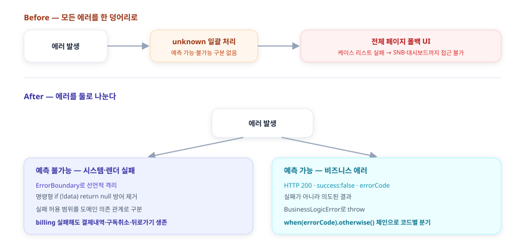
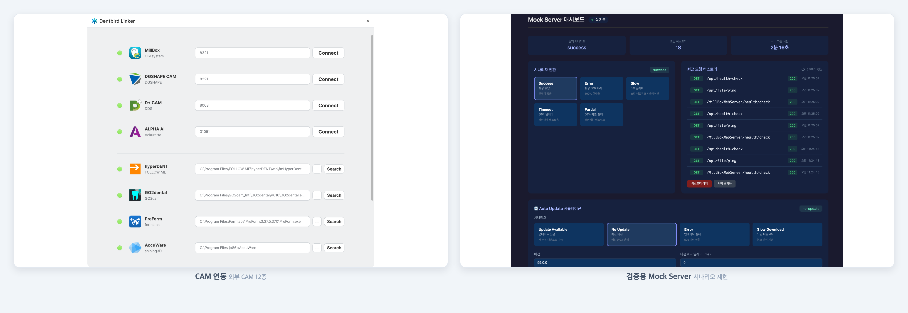
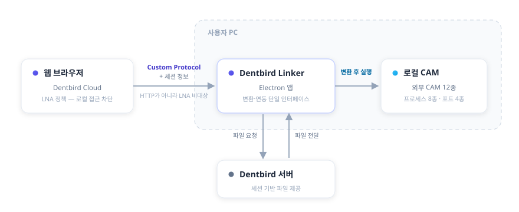

<!-- 당근(Karrot) Software Engineer, Frontend - 커머스 지원용 포트폴리오 -->
<!-- 마스터 portfolio.md에서 5개 선별·재배치 (AI 워크플로우 1번, 공고 자격 직격) -->

# 김진완 포트폴리오 | Frontend Developer

- [이력서](resume.html) · [블로그](https://crowwan.github.io/) · [깃허브](https://github.com/crowwan)

---

## About

2023년 9월부터 이마고웍스에서 AI 기반 치과 CAD/CAM SaaS인 **Dentbird**의 프론트엔드를 맡고 있습니다. 구독·결제, 3D 뷰어, 외부 CAM 연동처럼 외부 의존이 많은 복잡한 화면을 만들고, AI로 코드가 빠르게 바뀌는 환경에서도 안전하게 개발할 수 있도록 아키텍처·디자인 패턴·상태관리와 검증 체계를 설계하는 것이 일의 중심입니다. 동시에 그 프론트엔드를 받치는 모노레포·환경 분리·빌드·품질 자동화 같은 플랫폼 토대까지 한 제품 안에서 폭넓게 다뤄 왔습니다.

문제를 만나면 빠른 처치보다 **근본 원인을 정확히 파악한 뒤 해결하는 쪽**을 택합니다. 증상을 덮는 임시방편과 구조를 바로잡는 일을 구분하며, "해결됐다"가 아니라 **원인이 무엇이었는지 재현으로 확인될 때까지 규명합니다**. 우연히 해결된 수정은 같은 문제로 재발한다고 보기 때문입니다.

선택의 순간에는 **트레이드오프를 가능한 한 정량적으로 판단합니다**. 그 불편이 실제로 큰지, 해소 방안이 불편을 얼마나 줄이는지를 가늠하고, 투입 대비 효과가 크지 않으면 도입을 보류합니다. 기술도 **명확한 근거가 있을 때만 도입합니다** — 과거에는 뚜렷한 이유 없이 새 기술을 도입했지만, 지금은 그 기술이 어떤 문제를 해결하는지 분명할 때 채택합니다.

좋은 개발 문화는 **팀이 같은 방향을 공유하고 서로 이해할 때** 형성된다고 믿습니다. 그래서 혼자 옳은 결정보다 팀이 함께 납득하는 결정을, 성과뿐 아니라 **되돌린 결정과 한계까지 정직하게 남기는 것**을 중요하게 봅니다.

---

## Skills

React
TypeScript
Next.js
TanStack Query
Three.js
Electron
Playwright
Jest
Docker
AWS
GitHub Actions
Datadog

---

## AI를 판단 단계에 결합한 변경 감지 — 격리 재현 위 검증 워크플로우

`2025.11 ~` · `Claude · Docker · 런타임 Config · Playwright · EC2 · qase`

### 개요

AI를 코드 자동완성 같은 보조가 아니라 **"어떤 테스트가 이 변경에 필요한가"라는 판단 단계**에 결합한 워크플로우입니다. 테스트가 믿을 수 있게 돌아가는 격리 재현 환경을 먼저 만들고, 그 위에 **"바뀐 코드만 골라 테스트하는" AI 변경 감지**를 올렸습니다.

### 문제

전체 E2E를 매번 돌리면 느리고, 안 돌리면 회귀를 놓칩니다. 동시에 dev·qa에서는 멀쩡하던 것이 prod 배포 시 환경변수가 섞여 배포돼 핫픽스가 반복됐고, 특정 시점 버그 재현이 어려웠으며 E2E가 다른 변경의 간섭으로 흔들렸습니다.

### 해결 — 격리 재현 위에 AI 판단을 올린다

먼저 환경이 런타임에 결정되도록 **도메인 통합 라이브러리**를 구축해(런타임 분리 자체는 팀), **특정 커밋 시점으로 Docker를 기동해 클라이언트+서버+DB를 그대로 재현**하는 격리 환경을 만들었습니다.

{.diagram}

그 위에 **EC2에서 Claude를 상시 구동**해, 커밋 diff를 분석하고 **QA팀이 관리하는 qase 테스트 케이스 중 연관 케이스를 선별·실행**한 뒤 결과를 Teams로 보고하고, **실패를 실제 회귀와 테스트 코드 문제로 1차 분류**하는 파이프라인을 설계했습니다. 시작은 수백 개 qase 케이스를 사람이 검증하기 어렵다는 문제를 **Planner·Verifier 2-에이전트로 자동 검증**하던 도구(TC-Verify)였고, 이를 "변경 연관 테스트 선별"로 확장했습니다. 검증은 **10분 주기 크론잡**으로 자동화하고, 동시 실행·중복 분석을 막아 안정적으로 돌도록 했습니다.

{.diagram}

격리 환경 자체도 운영하며 다졌습니다 — 흩어진 E2E를 정리해 로그인 중복을 공통 헬퍼로 **약 93% 줄이고** Page Object로 리팩토링했으며, 만성적으로 실패하던 격리 daily를 원인별로 분리 진단해 **결제 경로 실패 약 28건을 0으로**, **8개 앱 동시 기동 시 S3 다운로드가 DNS를 포화**시키던 문제를 수정 유/무 대조 실행으로 확정해 공유 캐시 프리페치로 해소했습니다.

### 회고

핵심은 AI를 판단 단계에 넣었다는 것, 그리고 **그 판단이 틀릴 수 있다는 것까지 설계해야 한다**는 것입니다. 실제로 어떤 회귀가 **AI 리뷰가 오히려 통과시킨** 잘못된 테스트에서 비롯됐습니다 — 기획 의도가 코드·테스트에 없고 티켓 코멘트에만 있던 탓에, 맥락을 모르는 변경이 잘못된 동작을 E2E 단언으로 굳혔고 그 PR은 사람 리뷰어 없이 AI 승인만 받은 상태였습니다. 직접 바로잡았지만, AI를 판단 단계에 넣을수록 맥락 없는 오판 가능성까지 함께 설계해야 한다는 걸 배웠습니다.

선별 정확도·실행량 절감 같은 정량 효과는 아직 측정 근거가 없어 성과로 부풀리지 않고, EC2 운영 부담을 줄이려 이후 로컬 데일리 E2E 워크플로로 옮기고 있습니다. 도구가 아니라 **결정성**, 그리고 **AI 판단의 한계까지 설계하는 것**이 이 작업의 핵심이었습니다.

---

## 케이스 목록 썸네일 로딩 최적화 — 지연 로딩·요청 배치·실패 캐싱

`2025.10 ~ 2026.06` · `React · TanStack Query · IntersectionObserver · Context API`

### 개요

케이스 목록은 사용자가 가장 자주 보는 화면이고, 썸네일이 수십 장 표시됩니다. 이 화면의 **썸네일 로딩 성능**과, 운영 중 발생한 **깜빡임·무한 재요청 회귀**를 다룬 작업입니다.

### 문제

케이스 목록 썸네일은 "N장 = 네트워크 N요청"이 되기 쉽습니다. 게다가 운영 중 깜빡임과 무한 재요청이 발생했습니다. 무한 재요청의 원인은 **카드가 재마운트될 때마다 훅이 새로 생겨 같은 썸네일을 중복 요청**하고, 403 같은 영구 오류도 새 URL로 계속 다시 호출하는 구조였습니다.

### 해결

**IntersectionObserver로 viewport에 들어온 썸네일만 로드**하고, 50ms 윈도우 안의 요청을 모아 **한 번에 배치 요청**하는 공통 훅(Context Provider 기반)을 만들었습니다.

무한 재요청은 **캐시를 카드 바깥 Provider로 끌어올려 모든 카드가 공유**하게 하고, **성공(4분)뿐 아니라 실패(10초)도 캐시**해 풀었습니다 — 영구 오류를 짧게 기억해두면 재마운트돼도 네트워크를 다시 호출하지 않고 즉시 "No data"로 처리됩니다. 그 위에 단일 마운트 안의 `onError` 폭주를 억제하는 재시도 1회 클램프를 보조 장치로 두었고, **"성공 시 errorCount를 리셋하면 같은 영구 오류가 다시 반복된다"는 이유로 의도적으로 리셋하지 않았습니다**. 깜빡임은 로딩 상태를 첫 fetch에만 토글하고 재시도는 silent로 처리해 제거했습니다. 회귀 테스트로 "같은 Provider 안에서 재마운트돼도 중복 fetch 없음"을 검증합니다.

{.diagram}

### 회고

무한 재요청은 재시도 횟수만 제한해도 멈출 수는 있습니다. 하지만 그건 증상이고, 진짜 원인은 **카드가 재마운트될 때마다 훅이 새로 생겨 캐시가 소실되고 같은 오류를 다시 호출하는 구조**였습니다. 그래서 재시도 클램프는 보조로만 두고, 캐시를 카드 바깥 Provider로 끌어올려 구조 자체를 고쳤습니다. 다만 재마운트 자체를 없애는 건 더 큰 공사라, 거기까진 가지 않고 **공유 캐시로 우회하는 실용적 선택**을 했습니다 — 증상을 덮을지 구조를 고칠지 그 사이에서, 비용 대비 효과가 가장 큰 지점을 고른 작업이었습니다.

설계에서 하나 더 신경 쓴 건 실패를 다루는 방식입니다. 보통 캐시는 성공만 담지만, 여기서는 403 같은 영구 오류도 짧게(10초) 캐시했습니다. 실패를 기억하지 않으면 재마운트마다 같은 오류를 다시 호출하기 때문입니다 — 성공뿐 아니라 실패도 하나의 상태로 보고 캐싱한 것이 무한 재요청을 끊은 핵심이었습니다.

---

## B2B 구독·결제 프론트엔드 — 예측 가능/불가능 에러 분리

`2023.09 ~ 2025.07` · `React · TypeScript · TanStack Query`

### 개요

일회성 크레딧에서 반복 구독으로 결제 모델을 전환하는 시점에 구독·결제 화면을 전담했습니다. 플랜 업그레이드, 좌석 구매, 구독 취소·재개, 쿠폰, 결제수단 관리, 결제 히스토리를 맡았습니다. 동시에 이 프로젝트는 제가 프론트엔드 아키텍처와 에러 처리를 본격적으로 도입한 무대였고, 그중 가장 오래 붙들었던 것이 에러를 어떻게 다룰 것인가였습니다. 결제 인프라와 팝업 앱 기반은 팀과 함께였습니다.

### 문제 — 모든 에러가 한 덩어리였다

당시 회사에는 에러 처리에 대한 정의가 없었습니다. 사실 지금도 그렇습니다. 모든 에러를 하나의 unknown으로 일괄 처리하다 보니, 한 기능에서 발생한 에러가 전체 페이지를 에러 화면으로 바꿨습니다. 케이스 리스트 조회 한 번 실패하면 SNB도 대시보드도 접근하지 못했습니다.

근본 원인은 예측 가능한 에러와 예측 불가능한 에러를 구분하지 않은 것이었습니다. 구분이 없으니, 서버가 의도적으로 내려준 비즈니스 에러든 정말 예상하지 못한 시스템 실패든 똑같이 폴백 UI로 흡수돼버렸습니다.

### 해결 — 에러를 둘로 나누다

예측 불가능한 에러는 ErrorBoundary로 격리했습니다. 컴포넌트마다 흩어진 명령형 방어 코드 `if (!data) return null`을 ErrorBoundary로 걷어내고, 어디까지 실패를 허용할지를 도메인 의존 관계로 구분했습니다. billing 정보를 받지 못해도 결제 내역 조회·구독 취소·뒤로가기는 살아남습니다. 한 기능의 실패가 전체 페이지를 중단시키지 않습니다.

예측 가능한 에러는 코드별로 분기했습니다. 서버는 비즈니스 에러를 `HTTP 200 · success:false · errorCode` 형태로 내려줍니다. 이건 실패가 아니라 의도된 결과라 폴백 UI로 흡수하면 안 됩니다. `BusinessLogicError` 커스텀 클래스로 throw하고, `.when(errorCode, action).otherwise()` 체인으로 에러 코드별로 분기했습니다.

{.diagram}

### 회고

에러 처리의 출발점은 정교한 도구가 아니라 에러를 구분 짓는 일이라는 걸 이 프로젝트에서 배웠습니다. 예측 가능한 실패와 불가능한 실패를 나누지 않으면, 아무리 잘 만든 ErrorBoundary를 두어도 결국 다 같은 폴백으로 흡수됩니다.

이 구조는 모노레포로 이관된 뒤에도 `BusinessLogicError`와 `withErrorBoundary` HOC로 살아남았습니다. 다만 조직 차원의 에러 처리 정의는 여전히 없고, 무엇이 실패해도 무엇은 살아남아야 하는가를 결제 데이터 의존 관계까지 끊어내는 설계는 당시 출시 우선순위와 설계 역량의 한계로 끝까지 가지 못했습니다. 이 문제의식은 이후 조직 차원의 관측·복원력 표준으로 넓혔습니다.

또 패턴과 설계는 팀 전체의 공통 이해가 없으면 복잡도만 높인다는 것도 이때 배웠습니다. 에러 응답 형식만 해도 서버가 HTTP 200에 success:false로 내려줄지 4xx·5xx로 내려줄지부터 백엔드와 합의가 필요했고, 이 약속을 미리 맞춰두지 않으면 응답마다 어떻게 처리할지 다시 논의하는 비용이 계속 쌓였습니다.

---

## 웹·로컬 CAM 연동 Electron 데스크톱 앱 — Dentbird Linker

`2024.07 ~ 2025.12, 이후 단독 운영` · `Electron · React · TypeScript · Datadog`

### 개요

Dentbird에서 디자인한 보철 케이스를 사용자 PC에 설치된 **외부 CAM 소프트웨어**로 보내는 사내 연동 앱(Linker)입니다. 웹 브라우저에서 로컬 소프트웨어를 제어해야 하는데, 브라우저는 보안상 로컬 네트워크 접근을 막습니다. 이 통신 문제를 풀고 앱을 단독 설계·운영했습니다. 연동은 **파일을 전달하는 데이터 채널**과 **앱 설치·실행 여부를 아는 감지 채널**의 두 축으로 나뉘는데, 이 케이스는 그 둘을 모두 다룹니다.

### 문제

기존에는 케이스를 외부 CAM으로 보내려면 **다운로드 → 압축 해제 → 수동 투입**을 거쳐야 했고, 자체 로컬 서버가 없는 CAM은 연동 자체가 불가능했습니다. 게다가 Chrome의 **LNA(Local Network Access)** 정책이 웹→로컬 통신을 차단하면서, 권한 팝업을 놓친 사용자의 CS 문의가 늘었습니다. "지금 되는 방법"을 고르면 정책이 강화될 때 또 막히는 구조였습니다.

### 해결 — 대안 비교 후 장기 안정성 기준 선택

여러 통신 방식을 구현 속도가 아니라 **장기 안정성** 기준으로 비교했습니다.

| 방안 | 검토 결과 |
|------|-----------|
| WebSocket 로컬 서버 | 구현은 가장 빠르나 곧 LNA 적용 대상 → 1~2년 후 재차단될 단기 해법, **탈락** |
| HTTPS 로컬 서버 | 인증서·배포 부담 + 같은 LNA 사정 → **탈락** |
| **Custom Protocol** | HTTP 요청이 아니라 LNA 적용 대상이 아님 → **채택** |

Custom Protocol을 **중간 레이어**로 두어, 브라우저가 프로토콜로 Linker를 실행하며 세션 정보를 넘기면 Linker가 서버에서 파일을 직접 받아 변환 후 CAM을 실행하도록 재설계했습니다. 좌표계·전달 방식이 제각각인 **외부 CAM 12종**(프로세스 실행 방식 8종 + 포트 연동 방식 4종)의 차이는 **하나의 변환·연동 인터페이스로 추상화**했습니다.

{.diagram}

CAM 12종을 모두 설치하지 않고도 연동·자동 업데이트를 검증하려고, 케이스 상단의 **Mock Server**를 만들었습니다. CAM의 헬스체크·파일 핑 같은 엔드포인트와 자동 업데이트 응답을 흉내 내고, **성공·에러(500)·지연·타임아웃·부분 실패** 시나리오를 버튼으로 전환해 Linker가 각 상황에서 어떻게 동작하는지 재현했습니다.

### 설치 감지 — 감지를 믿지 않는 방향으로

브라우저는 LNA 정책 때문에 로컬 헬스체크로 앱 실행을 직접 확인할 수 없어, 창 포커스 변화 같은 **휴리스틱으로 추정**할 수밖에 없습니다. 감지를 완벽하게 만들려 하지 않고, **틀려도 사용자가 막히지 않는** 쪽으로 정책을 통일했습니다. 제각각이던 감지 타임아웃을 **3초로 수렴**하고, 미감지면 미설치로 간주하되 **설치 안내를 항상 비차단(non-trapping)으로 표시해** 어떤 경우에도 다음 행동(다운로드)이 가능하게 했습니다. 근본 해법으로는 **감지 판정 자체를 없애고 설치돼 있으면 자동 실행되는 방식**을 직접 제안해 기획·QA와 합의했습니다(착수 전).

### 회고

처음엔 로컬 서버 방식이 핵심이었지만 정책 변화로 수명이 다했고, 직접 폐기한 뒤 Custom Protocol 기반으로 옮겼습니다. "되는 방법"이 아니라 "오래 버티는 방법"을 고른 판단이 이 프로젝트의 핵심이었습니다. 브라우저·OS의 실행환경 정책(LNA, 포커스, 프로토콜 핸들러)이 웹과 로컬의 경계에서 무엇을 막고 허용하는지를, 이 과정에서 깊이 이해했습니다.

별개로, **Batch가 Electron에서 웹뷰 형태로 기능을 서비스하는 전환**에서는, 웹뷰 구조 설계에 의견을 보태고 **3D 렌더링 엔진이 웹뷰 환경에서도 동작하도록 함께 구현**했습니다(전환 자체는 팀 주도). 앱 컨테이너 안에서 웹을 띄우는 구조의 통신·실행 제약을 다뤄 본 경험입니다.

(Linker·Batch를 아우르는 LNA 대응 흐름은 팀과 함께였고, 본인 기여는 Linker 앱의 설계·구현·운영과 감지 정책 통일, 그리고 2단계 방향 제안입니다.)

---

## 공통 모듈 Micro Frontend — 제약 기반 통합 전략

`2023.09 ~ 2025.10` · `NX · Module Federation`

### 개요

4개 서비스(cloud·crown·modeler·milling)가 공유하던 공통 기능 4개(설정·내보내기·탐색기·뷰어)를 모듈화하면서, **"정답 기술"을 찾는 대신 그때의 조직·배포 제약에 맞는 통합 전략을 거듭 다시 고른** 과정입니다.

{.diagram}

### 문제

공통 기능이 하나 바뀔 때마다 **각 서비스에 같은 수정을 반복하고 전부 배포**해야 했습니다. 도메인도 관리팀도 분리돼 있어 변경 한 번의 비용이 컸습니다.

### 해결 — 써보고 뺀 판단의 연속

{.diagram}

먼저 컴포넌트를 **라이브러리로 배포**했지만 각 서비스가 버전업·재배포를 반복해야 해 문제가 그대로 남았습니다. 그래서 가장 빠르고 단순한 **iframe + postMessage** 런타임 통합으로 전환했습니다. 4개 앱이 한 모노레포로 합쳐지자 **빌드타임 통합**으로 옮겼지만, 막상 통합 배포가 실제로는 잘 이뤄지지 않았고 사내 배포 주기 제약으로 부담만 커졌습니다. 그래서 **다시 iframe으로 회귀**하되, 이번엔 same-origin으로 서빙해 CORS·인증 공유·origin 검증을 단순화했습니다.

**Module Federation**도 후보였지만, 다른 기능에 도입해본 경험상 초기 설정이 복잡하고 모노레포가 아닌 소비처에서 부담이 커 이 건에서는 제외했습니다 — 몰라서가 아니라 **써보고 트레이드오프로 뺀** 판단입니다. (console-client에는 Module Federation을 직접 적용했습니다.)

### 회고

같은 문제를 라이브러리 → iframe → 빌드타임 통합 → 다시 iframe으로 세 번 다르게 풀었습니다. iframe 통합과 console-client의 Module Federation은 제가 주도했고, 빌드 도구 전환은 팀과 함께였습니다. 매번 그때 더 낫다고 본 방법을 택했지만, 운영해보면 조직·배포 제약이 다른 답을 가리켰습니다 — 빌드타임 통합은 기술적으로 깔끔했어도 사내 배포 주기와 맞지 않아 결국 same-origin iframe으로 돌아왔습니다. 이 과정에서 **"정답 기술"은 없고 제약에 맞는 선택만 있다는 것**을 배웠습니다. 이 통합은 4개월간 공통 기능 4종을 단일 구현으로 유지했고, 이후 팀이 Vite로 표준을 통일하며 그 위로 수렴됐습니다.

별개로, 사내 공통 디자인 시스템(MUI 기반)에도 **DatePicker 확장**(onClose 덮어쓰기 버그 수정·placeholder·onClick 핸들러 노출) 등 공통 컴포넌트 기여와 v3.0.0 릴리스 관리를 했습니다.

---

## 함께 보기

- **[이력서](resume.html)** — 전체 경력과 기술 스택
- **[깃허브](https://github.com/crowwan)** · **[블로그](https://crowwan.github.io/)**
