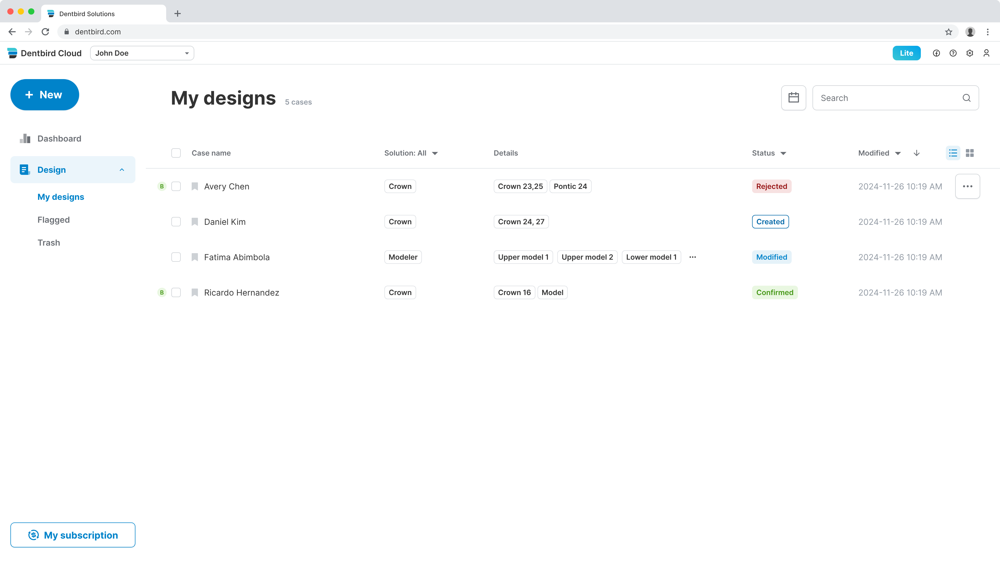
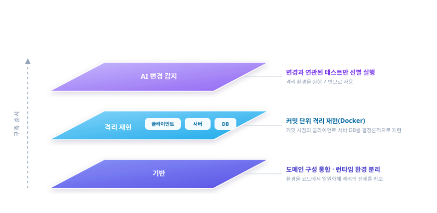
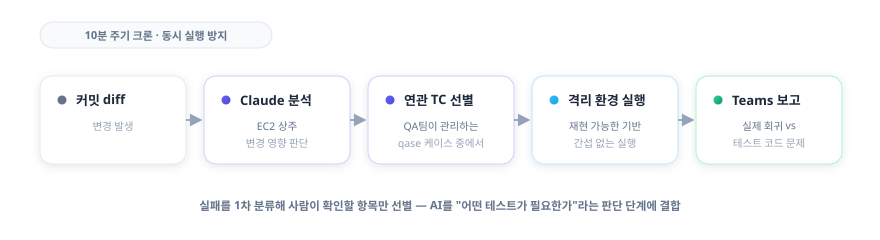
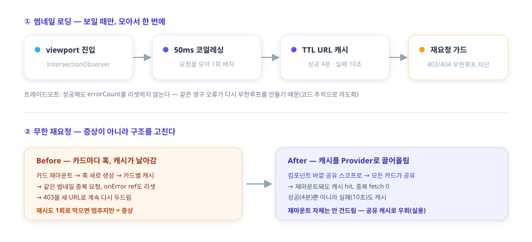
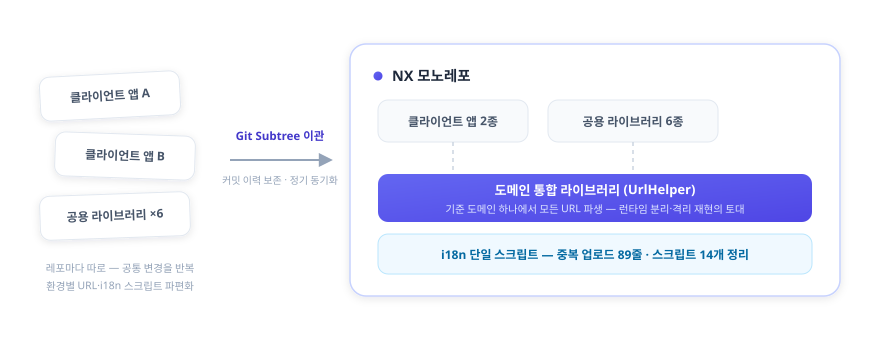
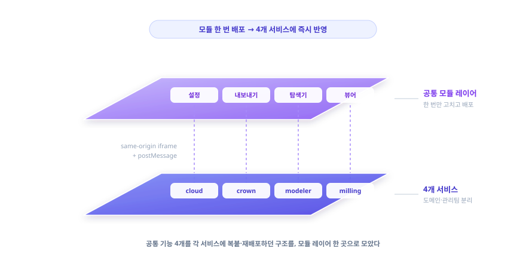
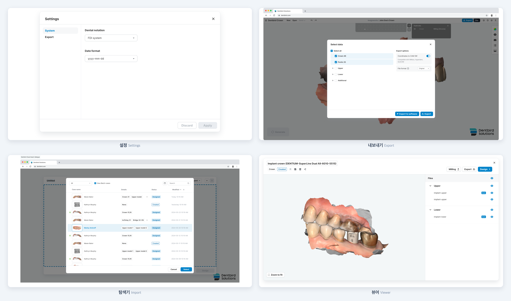
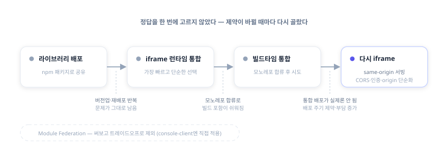
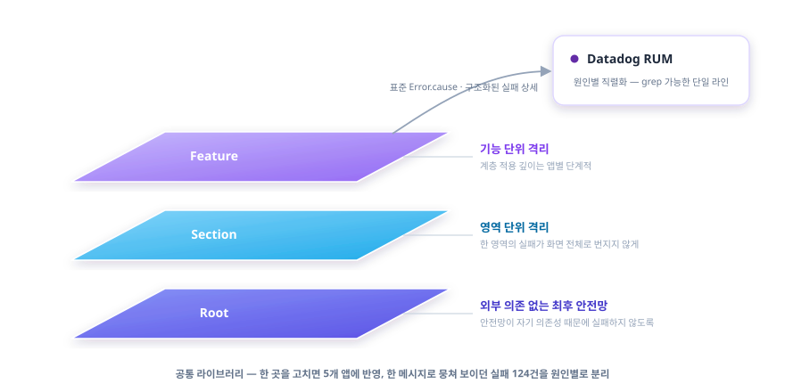

<!-- 오늘의집(버킷플레이스) Frontend Engineer 지원용 포트폴리오 -->
<!-- 메인 portfolio.md에서 JD 매칭 5개 케이스 발췌·재번호 (테스트·CI / 성능 / 아키텍처 2축 / 복원력) -->

# 김진완 포트폴리오 | Frontend Developer

블로그 velog.io/@crowwan · 깃허브 github.com/crowwan

---

## About

2023년 9월부터 이마고웍스에서 AI 기반 치과 CAD/CAM SaaS인 **Dentbird**의 프론트엔드를 맡고 있습니다. 복잡한 화면과 3D 뷰어를 만들고, 그 코드가 오래 버티도록 아키텍처·디자인 패턴·상태관리를 설계하는 것이 일의 중심입니다. 동시에 그 프론트엔드를 받치는 모노레포·환경 분리·빌드·품질 자동화 같은 플랫폼 토대까지 한 제품 안에서 폭넓게 다뤄 왔습니다.

문제를 만나면 빠른 처치보다 **근본 원인을 정확히 파악한 뒤 해결하는 쪽**을 택합니다. 증상을 덮는 임시방편과 구조를 바로잡는 일을 구분하며, "해결됐다"가 아니라 **원인이 무엇이었는지 재현으로 확인될 때까지 규명합니다**. 우연히 해결된 수정은 같은 문제로 재발한다고 보기 때문입니다.

선택의 순간에는 **트레이드오프를 가능한 한 정량적으로 판단합니다**. 그 불편이 실제로 큰지, 해소 방안이 불편을 얼마나 줄이는지를 가늠하고, 투입 대비 효과가 크지 않으면 도입을 보류합니다. 기술도 **명확한 근거가 있을 때만 도입합니다** — 과거에는 뚜렷한 이유 없이 새 기술을 도입했지만, 지금은 그 기술이 어떤 문제를 해결하는지 분명할 때 채택합니다.

좋은 개발 문화는 **팀이 같은 방향을 공유하고 서로 이해할 때** 형성된다고 믿습니다. 그래서 혼자 옳은 결정보다 팀이 함께 납득하는 결정을, 성과뿐 아니라 **되돌린 결정과 한계까지 정직하게 남기는 것**을 중요하게 봅니다.

---

## Skills

React
TypeScript
Next.js
TanStack Query
Three.js
Electron
Playwright
Jest
Docker
AWS
GitHub Actions
Datadog

---

## Case 1. 신뢰할 수 있는 테스트를 위해, 재현 가능한 환경을 만든다 — 격리 재현과 AI 변경 감지

`2025.11 ~` · `Docker · MongoDB · 런타임 Config · Playwright · EC2 · Claude · qase`

### 개요

테스트·디버깅의 신뢰성 문제를, 테스트가 믿을 수 있게 돌아가는 **재현 가능한 환경을 만드는 방향**으로 푼 프로젝트입니다. 선행 구조(Case 3의 도메인 통합 + 팀의 런타임 분리)부터 쌓고, 그 위에 격리 재현 환경을 올리고, 다시 그 위에 **"바뀐 코드만 골라 테스트하는" AI 변경 감지**까지 올렸습니다.

### 문제

dev·qa에서는 멀쩡하던 것이 **prod 배포 시 dev 환경변수가 박힌 채 배포**되는 일이 있었고, 그 결과 배포 직후 곧바로 핫픽스를 다시 배포하는 일이 반복됐습니다. 동시에 특정 시점의 버그를 재현하기 어려웠고, E2E가 다른 변경의 간섭으로 쉽게 흔들렸습니다.

### 해결 — 선행 구조 먼저, 그 위에 격리

원인은 **빌드 시점에 환경변수가 번들에 박히는 구조**였습니다. 런타임 분리 자체는 팀이 진행했고, 본인은 그 토대로 **도메인 통합 라이브러리(Case 3)**를 깔았습니다. 환경이 런타임에 결정되니, **특정 커밋 시점으로 Docker를 띄워 그때의 클라이언트 + 서버 + DB를 그대로 재현**하는 격리 환경을 쌓을 수 있었습니다.

{.diagram}

핵심은 격리 환경을 바로 만든 게 아니라, *"격리하기 쉬운 환경"*을 먼저 깔고 그 위에 쌓았다는 점입니다. 이 환경은 **다른 변경의 간섭 없이 특정 시점을 결정론적으로 재현**하는 것을 목표로 합니다.

### 결과

- 본인이 깐 도메인 통합 토대 위에서 팀의 런타임 분리가 맞물려 환경별 빌드가 사라지고 **배포 직후 핫픽스 반복이 해소**됐고, 본인은 그 위에 격리 재현 환경을 직접 구축
- 격리 이전에 흩어져 있던 E2E부터 정리했습니다 — 백오피스 전 영역에 수십 개 suite를 구축하고 로그인 중복을 공통 헬퍼로 **약 93% 줄였으며**, 인라인 셀렉터를 Page Object로 리팩토링했습니다. 이렇게 안정화한 E2E를 격리 기반 위로 옮겨, 아래 AI 변경 감지의 실행 기반으로 삼았습니다
- 만성적으로 실패하던 격리 daily는 **원인별로 분리 진단**했습니다. 본인 몫으로 **결제(billtap) 경로 실패 약 28건을 근본 수정해 0으로** 만들었고(머지 후 실증), **8개 앱 동시 기동 시 S3 다운로드가 DNS를 포화**시키던 문제를 수정 유/무 대조 실행으로 확정해 공유 캐시 프리페치(1회 워밍)로 해소했습니다 — 처음의 오진(포트 문제)은 같은 대조 실행으로 스스로 반증하고 버렸습니다.

### 그 위에 — 바뀐 코드만 골라 테스트한다 (AI 변경 감지)

전체 E2E를 매번 돌리면 느리고, 안 돌리면 회귀를 놓칩니다. 이 이분법 대신 **"변경과 관련된 테스트만 골라 실행"**하는 중간 해법을 격리 인프라 위에 올렸습니다. 시작은 수백 개 qase 테스트 케이스를 사람이 일일이 검증하기 어렵다는 문제를 **Planner·Verifier 2-에이전트로 자동 검증**하던 도구(TC-Verify)였고, 이를 "변경 연관 테스트 선별"로 확장한 것입니다.

**EC2에 Claude를 상주**시켜, 커밋 diff를 분석하고 **QA팀이 관리하는 qase 테스트 케이스 중 연관 케이스를 선별·실행**한 뒤 결과를 Teams로 보고하고, **실패를 실제 회귀와 테스트 코드 문제로 1차 분류**하는 파이프라인을 설계했습니다. 검증은 **10분 주기 크론잡**으로 자동화하고, 동시 실행·중복 분석을 막아 안정적으로 돌도록 했습니다.

{.diagram}

단순한 테스트 코드 문제(셀렉터 변경 등)와 실제 API 회귀를 **1차로 갈라**, 사람이 확인할 것만 추려 보고하도록 했습니다. 핵심은 AI를 코드 자동완성 같은 보조 도구가 아니라 **"어떤 테스트가 이 변경에 필요한가"라는 판단 단계**에 결합했다는 점입니다.

### 회고

"왜 내 PC에선 되는데 CI에선 안 되지"를 매번 디버깅하는 대신, 그 질문 자체가 안 나오는 환경을 만드는 게 목표였습니다. 도구가 아니라 **결정성**이 핵심이었습니다.

한 가지 더 배웠습니다. 격리 환경과 2주간 씨름한 시행착오를 17건·약 36시간으로 직접 집계해 보니, 문제는 환경이 불안정해서가 아니라 **같은 환경을 두 목적(빌드본 그대로 검증 vs 방금 고친 코드 swap)으로 쓰면서 한쪽엔 결정성이 오히려 독이 됐기** 때문이었습니다. 그래서 두 모드를 명시적으로 분리하는 결정을 남겼습니다 — 결정성은 절대선이 아니라 용도에 따라 양날이라는 걸, 운영 피로를 데이터로 바꿔 확인한 셈입니다.

AI 변경 감지에서도 한계를 정직하게 마주했습니다. 선별·분류는 1차 판단이라 사람의 확인이 필요하고, EC2 보안 정책·스케줄 안정성의 운영 부담 때문에 이후 로컬 데일리 E2E 워크플로로 재편하고 있습니다. 선별 정확도·실행량 절감 같은 정량 효과는 아직 측정 근거를 확보하지 못해 메커니즘과 한계를 정직하게 두고 있습니다. 더 본질적으로는, 어떤 회귀가 **AI 리뷰가 오히려 통과시킨** 잘못된 테스트에서 비롯됐습니다 — 기획 의도가 코드·테스트에 안 박히고 티켓 코멘트에만 있던 탓에 맥락을 모르는 변경이 잘못된 동작을 E2E 단언으로 굳혔고, 그 PR은 사람 리뷰어 없이 AI 승인만 받은 상태였습니다. 직접 바로잡았지만, AI를 판단 단계에 넣을수록 그 판단이 맥락 없이 틀릴 수 있다는 것까지 함께 설계해야 한다는 교훈이 남았습니다.

---

## Case 2. 케이스 목록 썸네일 — 보일 때만, 모아서, 실패도 캐시

`2025.10 ~ 2026.06` · `React · TanStack Query · IntersectionObserver · Context API`

### 개요

케이스 목록은 사용자가 가장 자주 보는 화면이고, 썸네일이 수십 장 깔립니다. 이 화면의 **썸네일 로딩 성능**과, 운영 중 터진 **깜빡임·무한 재요청 회귀**를 다룬 작업입니다.

### 문제

케이스 목록 썸네일은 "N장 = 네트워크 N요청"이 되기 쉽습니다. 게다가 운영 중 깜빡임과 무한 재요청이 터졌습니다. 무한 재요청의 원인은 **카드가 재마운트될 때마다 훅이 새로 생겨 같은 썸네일을 중복 요청**하고, 403 같은 영구 오류도 새 URL로 계속 다시 두드리는 구조였습니다.

### 해결

**IntersectionObserver로 viewport에 들어온 썸네일만 로드**하고, 50ms 윈도우 안의 요청을 모아 **한 번에 배치 요청**하는 공통 훅(Context Provider 기반)을 만들었습니다.

무한 재요청은 **캐시를 카드 바깥 Provider로 끌어올려 모든 카드가 공유**하게 하고, **성공(4분)뿐 아니라 실패(10초)도 캐시**해 풀었습니다 — 영구 오류를 짧게 기억해두면 재마운트돼도 네트워크를 다시 두드리지 않고 즉시 "No data"로 떨어집니다. 그 위에 단일 마운트 안의 `onError` 폭주를 막는 재시도 1회 클램프를 보조로 뒀고, **"성공 시 errorCount를 리셋하면 같은 영구 오류가 또 루프를 돈다"는 이유로 일부러 리셋하지 않았습니다**. 깜빡임은 로딩 상태를 첫 fetch에만 토글하고 재시도는 silent로 둬서 없앴습니다. 회귀 가드 테스트로 "같은 Provider 안에서 재마운트돼도 중복 fetch 없음"을 고정했습니다.

{.diagram}

### 회고

무한 재요청은 재시도 횟수만 틀어막아도 멈추기는 합니다. 하지만 그건 증상이고, 진짜 원인은 **카드가 재마운트될 때마다 훅이 새로 생겨 캐시가 날아가고 같은 오류를 다시 두드리는 구조**였습니다. 그래서 재시도 클램프는 보조로만 두고, 캐시를 카드 바깥 Provider로 끌어올려 구조 자체를 고쳤습니다. 다만 재마운트 자체를 없애는 건 더 큰 공사라, 거기까진 가지 않고 **공유 캐시로 우회하는 실용적 선택**을 했습니다 — 증상을 덮을지 구조를 고칠지 그 사이에서, 비용 대비 효과가 가장 큰 지점을 고른 작업이었습니다.

---

## Case 3. 흩어진 레포를 모노레포로 — 통합과 환경 일원화

`2024.06 ~` · `TypeScript · NX · Git Subtree · i18n`

### 개요

별도 레포로 흩어져 있던 클라이언트 앱·공용 라이브러리를 하나의 NX 모노레포로 모으고, 환경별로 제각기 구성하던 도메인·URL을 일원화한 프로젝트입니다. 이후 격리 재현 환경(Case 1)이 이 토대 위에 올라갑니다.

### 문제

클라이언트 앱들이 환경별 URL·도메인을 **각자 다르게 구성**하고 있었고, 별도 레포에 흩어져 있어 공통 변경을 여러 곳에 반복해야 했습니다. 다국어 관리도 중복 업로드와 흩어진 스크립트로 파편화돼 있었습니다.

### 해결

- **NX 유지 + OOM 해소** — 모노레포 도구를 새로 고르는 대신 기존 NX를 유지했습니다. 전환 이득이 이관·재학습 비용을 넘지 못한다고 봤기 때문입니다. 잔존하던 `webpack.config.js`가 NX 자동 타겟 추론을 유발해 불필요한 빌드 산출물과 OOM을 일으키던 것을 진단해, **빌드 태스크를 11개에서 9개로 줄이고 OOM을 해소**했습니다.
- **Git Subtree로 이관** — 별도 레포의 클라이언트 앱 2종·공용 라이브러리 6종을 메인 NX 모노레포로 옮겼습니다. 단순 복사가 아니라 **커밋 이력을 보존**하고 네임스페이스 충돌을 리네임으로 해소했으며, 이후에도 정기 동기화를 운영했습니다.
- **도메인 통합 라이브러리** — 환경별로 흩어진 도메인·URL 구성을 단일 라이브러리로 일원화했습니다. 기준 도메인 하나에서 backend·gateway·테넌트 호스트 등이 한 곳에서 파생됩니다. (팀의 런타임 환경 분리·격리 재현 환경이 이 라이브러리를 기반으로 동작합니다.)
- **다국어 중앙화** — 중복 업로드 89줄과 14개 스크립트로 흩어진 i18n 관리를 단일 스크립트로 모았습니다.

{.diagram}

기준 도메인(통합/레거시) 하나에서 cloud·accounts·api URL이 모두 파생됩니다. 통합 도메인에서는 상대 경로로, 레거시에서는 환경변수 기반 절대 URL로 갈라지되 호출부는 `UrlHelper.cloud()` 한 형태로 통일됩니다.

### 회고

"무엇을 합칠까"보다 "합친 뒤에도 흔들리지 않을 토대를 먼저 까는 것"이 중요했습니다. 도메인 통합 라이브러리라는 선행 구조가 있었기에, 다음 단계인 격리 재현 환경이 가능했습니다.

---

## Case 4. 정답 기술이 아니라 제약에 맞춘 통합 — 공통 모듈 Micro Frontend

`2023.09 ~ 2025.10` · `NX · Module Federation`

### 개요

4개 서비스(cloud·crown·modeler·milling)가 공유하던 공통 기능 4개(설정·내보내기·탐색기·뷰어)를 모듈화하면서, **"정답 기술"을 찾는 대신 그때의 조직·배포 제약에 맞는 통합 전략을 거듭 다시 고른** 과정입니다.

{.diagram}

### 문제

공통 기능이 하나 바뀔 때마다 **각 서비스에 같은 수정을 반복하고 전부 배포**해야 했습니다. 도메인도 관리팀도 분리돼 있어 변경 한 번의 비용이 컸습니다.

### 해결 — 써보고 뺀 판단의 연속

{.diagram}

먼저 컴포넌트를 **라이브러리로 배포**했지만 각 서비스가 버전업·재배포를 반복해야 해 문제가 그대로 남았습니다. 그래서 가장 빠르고 단순한 **iframe + postMessage** 런타임 통합으로 틀었습니다. 4개 앱이 한 모노레포로 합쳐지자 **빌드타임 통합**으로 옮겼지만, 막상 통합 배포가 실제로는 잘 이뤄지지 않았고 사내 배포 주기 제약으로 부담만 커졌습니다. 그래서 **다시 iframe으로 회귀**하되, 이번엔 same-origin으로 서빙해 CORS·인증 공유·origin 검증을 단순화했습니다.

**Module Federation**도 후보였지만, 다른 기능에 도입해본 경험상 초기 설정이 복잡하고 모노레포가 아닌 소비처에서 부담이 커 이 건에서는 제외했습니다 — 몰라서가 아니라 **써보고 트레이드오프로 뺀** 판단입니다. (console-client에는 Module Federation을 직접 적용했습니다.)

### 회고

iframe의 비용(로딩 지연, 라이브러리 중복 로딩, postMessage의 File/Blob 제한)까지 직접 확인하며, **"정답 기술"은 없고 그때의 조직·배포 제약에 맞는 선택만 있다**는 걸 배웠습니다. iframe 런타임 통합과 console-client의 Module Federation을 주도했고, 빌드 도구 전환은 팀과 함께 진행하며 압축 해제 워커가 Vite·Rspack 양쪽 빌드에서 올바른 경로를 찾도록 한 공통 유틸을 맡았습니다. 이 통합은 약 4개월 운영 후 팀이 Vite로 표준을 통일하며 흡수됐습니다. 같은 문제를 세 번 다르게 푼 과정 자체가 이 케이스의 핵심입니다.

---

## Case 5. 에러는 잡히는데 추적이 안 된다 — 관측·복원력 표준화

`2026.04 ~` · `React · TypeScript · Datadog RUM`

### 개요

에러는 잡히지만 **어디서 왜 났는지 추적되지 않던** 상태를, 5개 앱에 공통 표준으로 정리한 프로젝트입니다.

### 문제

여러 fail mode가 같은 UI·같은 메시지로 흡수돼, 예컨대 QA 환경 RUM에서 124건의 실패가 `new Error('failedToExportMeshes')` **한 줄로 collapse**되어 원인 추적이 불가능했습니다.

### 해결

- **Root → Section → Feature 3계층 ErrorBoundary 체계를 설계**해 에러를 계층별로 격리하고, 5개 앱을 공통 표준으로 정렬했습니다(계층 적용 깊이는 앱별 단계적).
- 에러를 **Datadog 관측 표준에 맞춰 직렬화**해, 한 메시지로 뭉쳐 보이던 실패 124건을 원인별로 추적 가능하게 만들었습니다. 적용 전후는 **격리 환경에서 RUM 데이터를 정량 비교**해 검증했습니다.
- **안전망은 발생 위치만 자동 표기**하고 의미 부여는 호출자가 명시하도록 책임을 분리했으며, 최상위 안전망에는 외부 의존을 두지 않아 **안전망이 자기 의존성 때문에 죽지 않도록** 설계했습니다.

{.diagram}

가시성을 높이는 방법으로 처음엔 `react-error-boundary` 라이브러리를 검토했지만 **기각**했습니다 — ① 실제 실패는 렌더가 아니라 **async 이벤트 핸들러**(파일 다운로드·파싱)에서 나는데 이 라이브러리는 render-time 에러만 잡고, ② iframe 안 모듈의 boundary는 host까지 전파되지 않으며, ③ 결국 throw 지점마다 wrap 코드가 늘어 피하려던 분기 증식이 반복되기 때문입니다. 대신 **에러 객체 자체에 풍부한 metadata를 담는** 방식(표준 `Error.cause` + 구조화된 실패 상세)을 택해, throw 지점은 한 줄로 두고 RUM에는 grep 가능한 단일 라인으로 직렬화했습니다. 공통 라이브러리라 **한 곳을 고치면 5개 앱에 반영**됩니다.

에러를 라이브러리(`instanceof`)에 묶지 않고 **shape(duck typing)으로 판별·분류**했습니다. axios든 fetch든 응답 형태만 보고 HTTP 상태를 뽑아 같은 기준으로 6분류하며, 이 분류기는 이후 공통 라이브러리로 승격됐습니다.

관측 표준 정렬 종합 계획을 직접 작성·주도하고 **5개 PR로 분해**해 적용했습니다.

같은 복원력 관점을 데이터 로딩으로도 확장하려 합니다 — 3D 뷰어에서 여러 design 중 일부 mesh가 손상돼도 `Promise.allSettled`로 **살아있는 mesh는 렌더하고 누락은 ModelTree에 표시**해, "전부 실패"와 "부분 실패"를 하나의 흐름에서 가르는 방향을 제안했습니다(착수 전). 에러 바운더리를 모든 곳에 두는 대신 **장애 허용 범위를 화면이 직접 설계한다**는 원칙을 데이터 흐름에 적용하려는 구상입니다.

### 회고

직접 만든 7분류 에러 체계가 특정 앱에 치우쳐 있던 걸 인정하고, **팀 공통 표준에 맞춰 폐기·정렬**했습니다. 내가 만든 걸 고집하는 것보다 팀 표준으로 수렴시키는 게 관측의 가치를 살린다고 봤습니다.

이 문제의식의 출발점은 구독·결제 프론트엔드에서 에러를 예측 가능/불가능으로 처음 구분한 경험이었고, 그때 한 프로젝트 안에 머물렀던 정리를 이번에 5개 앱 조직 표준으로 끌어올렸습니다.

