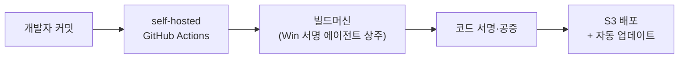
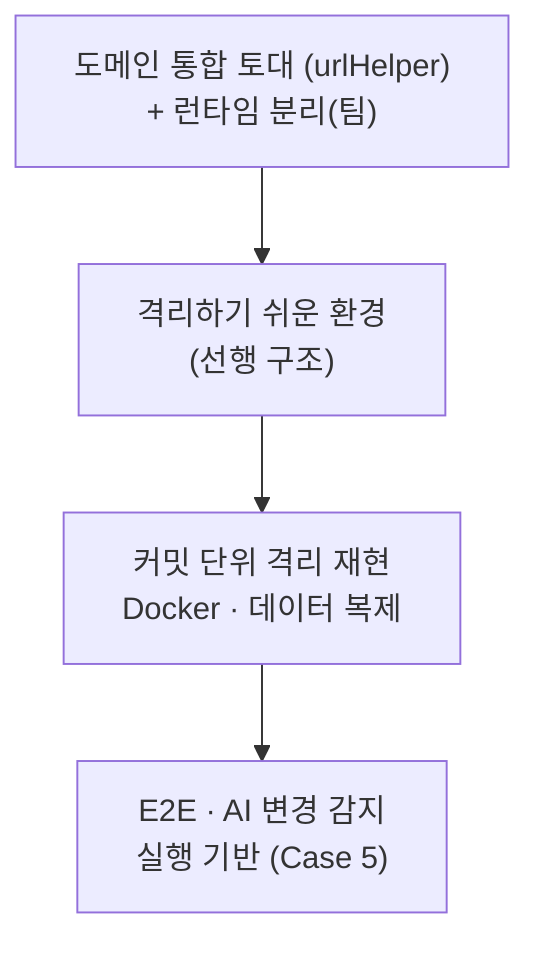
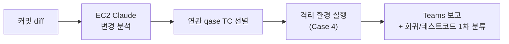
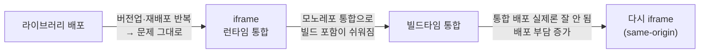
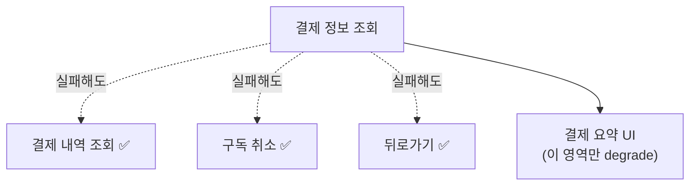
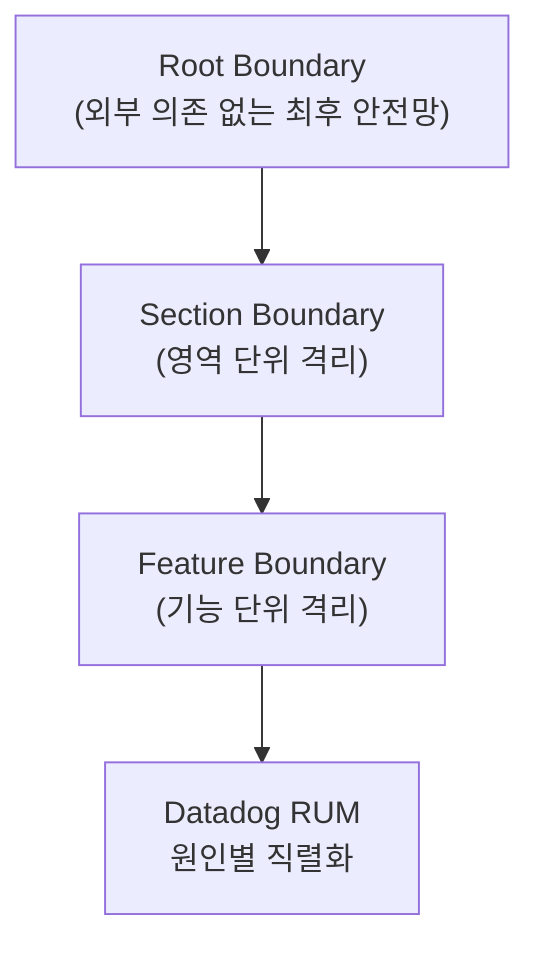

# 김진완 포트폴리오 | Frontend Developer

> **Dentbird의 프론트엔드를 맡아 웹·데스크톱 앱부터 모노레포·환경 분리 같은 플랫폼 토대, 빌드·배포, 품질 자동화까지 담당했습니다.**
>
> 브라우저 보안 정책에 막힌 웹↔로컬 연동을 Custom Protocol로 재설계하고, 담당자 PC에 묶여 있던 데스크톱 빌드를 자동화 파이프라인으로 옮겼으며, 테스트가 거의 없던 제품에 격리 재현 환경을 만들고, 그 위에 AI로 변경을 감지하는 회귀 검증 체계를 설계했습니다.
>
> 기술은 당장 빠른 것보다 오래 버티는 것을 기준으로 고르려 했고, 한 번 정한 뒤에도 운영하며 한계를 만나면 다시 설계했습니다. 그 과정에서 되돌린 결정과 도입하지 않은 결정도 정직하게 적었습니다.

- [이력서](resume.html) · [블로그](https://velog.io/@crowwan) · [깃허브](https://github.com/crowwan)

---

## About

2023년 9월부터 이마고웍스에서 AI 기반 치과 CAD/CAM SaaS인 **Dentbird**의 프론트엔드를 맡고 있습니다. 웹·Electron 데스크톱 앱 구현부터 모노레포 통합·런타임 환경 분리·빌드/배포·품질 자동화까지, 한 제품 안에서 폭넓게 전담해 왔습니다.

**Skills**

- **Language / UI** — TypeScript, JavaScript · React 18/19, Next.js · MUI, Emotion · TanStack Query, Recoil
- **Desktop** — Electron (IPC, Deep Link, Custom Protocol, Auto Update, Code Signing)
- **Build / Arch** — NX, pnpm, Git Subtree, Module Federation, iframe + postMessage, 런타임 Config
- **3D / Graphics** — Three.js, WebGL, draco3d, SRGB ColorManagement
- **Quality / Infra** — Playwright, Jest, Vitest, MSW, qase · GitHub Actions(self-hosted), Docker, AWS(EC2/S3) · Datadog RUM/Logs

> 🖼️ **[이미지]** 표지 — Dentbird 제품(웹 + 데스크톱) 대표 화면 모음. 인사 담당자가 "어떤 제품을 만들었는지" 한눈에 보도록.

---

## Case 1. 웹과 로컬 CAM을 잇는 Electron 데스크톱 앱 — Dentbird Linker

`2024.07 ~ 2025.12, 이후 단독 운영` · `Electron · React · TypeScript · Custom Protocol · Datadog`

> 🖼️ **[이미지]** Linker 실행 흐름 — 웹에서 "CAM으로 보내기" 클릭 → Linker 실행 → CAM 소프트웨어가 케이스를 받는 장면(스크린샷 3컷 또는 짧은 GIF).

### 개요

Dentbird에서 디자인한 보철 케이스를 사용자 PC에 설치된 **외부 CAM 소프트웨어**로 보내는 사내 연동 앱(Linker)입니다. 웹 브라우저에서 로컬 소프트웨어를 제어해야 하는데, 브라우저는 보안상 로컬 네트워크 접근을 막습니다. 이 통신 문제를 풀고 앱을 단독 설계·운영했습니다.

### 문제

기존에는 케이스를 외부 CAM으로 보내려면 **다운로드 → 압축 해제 → 수동 투입**을 거쳐야 했고, 자체 로컬 서버가 없는 CAM은 연동 자체가 불가능했습니다. 게다가 Chrome의 **LNA(Local Network Access)** 정책이 웹→로컬 통신을 차단하면서, 권한 팝업을 놓친 사용자의 CS 문의가 늘었습니다. "지금 되는 방법"을 고르면 정책이 강화될 때 또 막히는 구조였습니다.

### 해결 — 대안 비교 후 장기 안정성 기준 선택

여러 통신 방식을 구현 속도가 아니라 **장기 안정성** 기준으로 비교했습니다.

| 방안 | 검토 결과 |
|------|-----------|
| WebSocket 로컬 서버 | 구현은 가장 빠르나 곧 LNA 적용 대상 → 1~2년 후 재차단될 단기 해법, **탈락** |
| HTTPS 로컬 서버 | 인증서·배포 부담 + 같은 LNA 사정 → **탈락** |
| **Custom Protocol** | HTTP 요청이 아니라 LNA 적용 대상이 아님 → **채택** |

Custom Protocol을 **중간 레이어**로 두어, 브라우저가 프로토콜로 Linker를 실행하며 세션 정보를 넘기면 Linker가 서버에서 파일을 직접 받아 변환 후 CAM을 실행하도록 재설계했습니다. 좌표계·전달 방식이 제각각인 외부 CAM 12종의 차이는 **하나의 변환·연동 인터페이스로 추상화**했습니다.

명세가 없던 외부 연동은, 기존 export 동작을 **특성화(characterization) 테스트로 고정한 뒤 구현으로 통과**시키는 방식으로 안전하게 재구현했습니다.

> 💻 **[코드]** 외부 CAM별 좌표계·전달 방식을 단일 인터페이스로 묶은 변환 어댑터 구조(대표 1종) — 회사 레포에서 발췌 예정.

### 회고

처음엔 로컬 서버 방식이 핵심이었지만 정책 변화로 수명이 다했고, 직접 폐기한 뒤 Custom Protocol 기반으로 옮겼습니다. 지금도 한 가지 한계가 남아 있습니다 — **앱 실행 감지가 창 포커스 변화 휴리스틱에 의존**해, 사용자가 다른 창을 클릭하는 등의 상황에서 오탐이 생길 수 있습니다. 이를 핵심 경로에서 분리하는 방향으로 개선하고 있습니다. "되는 방법"이 아니라 "오래 버티는 방법"을 고른 판단이 이 프로젝트의 핵심이었습니다.

---

## Case 2. 담당자 PC에 묶인 데스크톱 빌드를 자동화 파이프라인으로

`2024 ~` · `Electron · electron-builder · electron-updater · GitHub Actions(self-hosted) · Azure Pipelines · 코드 서명·공증 · S3`

> 🖼️ **[이미지]** 빌드 파이프라인 재설계 전/후 비교 다이어그램 또는 빌드 시간 단축 그래프(36분 → 20분).

### 개요

두 데스크톱 앱(Batch·Linker)의 빌드·서명·배포 파이프라인입니다. 빌드가 담당자 로컬 PC에서 돌고 코드 서명은 인프라팀의 USB에 묶여 있어, **그 PC나 담당자가 자리를 비우면 출시가 멈추는** 구조였습니다.

### 문제

- macOS 빌드가 길고, 빌드가 특정 담당자 PC에 종속돼 있었습니다.
- Windows 코드 서명은 인프라팀이 보관한 **서명 USB**가 있어야만 가능해, 매 배포마다 사람과 장비에 의존했습니다.

### 해결

빌드를 **물리 빌드머신 + self-hosted GitHub Actions**로 옮기고, **Windows 코드 서명 에이전트를 빌드머신에 직접 설치·풀 등록**해 단독 운영하도록 만들었습니다. 서명 USB와 인프라팀 의존을 끊은 것입니다. macOS 파이프라인은 빌드 단계를 재설계해 약 36분에서 20분 수준으로 단축했습니다.

### 되돌린 결정 — 정직하게 남기는 트레이드오프

이 프로젝트에는 **도입했다가 회수한 결정**과 **검토 끝에 도입하지 않은 결정**이 함께 있습니다.

- **macOS 아키텍처 번복** — Universal → arm64 → 다시 Intel로 **11일간 3연속 번복**했습니다. 용량이 2배가 되는 트레이드오프를 도입·운영·회수까지 직접 감당하며, 아키텍처 결정이 용량·호환성·배포에 어떻게 번지는지 체득했습니다.
- **빌드 과정 내 코드 서명 통합은 도입하지 않음** — 원래는 빌드 안에서 서명까지 끝내는 게 정석입니다. 저는 한발 더 나아가 **인프라팀 개입 없이 개발자가 배포 준비가 끝난 아티팩트를 자율적으로 빌드**하고, 그걸 넘겨 서명 후 자동 업데이트까지 동작하는 흐름을 만들려 했습니다. 그러나 **서명 후 바이너리가 바뀌면 체크섬이 어긋나 자동 업데이트가 깨지는** 문제를 확인하고, 오히려 더 번거로워질 것으로 판단해 도입하지 않았습니다.
- **blue-green 무중단 배포** — 도입했으나, green 검증 자동화는 환경·빌드가 2배가 되는 운영 비용 대비 가치가 낮다고 보아 보류했습니다.

### 회고

자동 업데이트가 조용히 실패하던 문제를 추적하다, 무결성 검증이 "빌드 시점에 기록된 해시 = 실제 바이너리 해시"라는 전제 위에 선다는 걸 알게 됐습니다. 증상이 아니라 **전제를 건드리는 결정**(어디서 서명할 것인가)이 곧 업데이트 안정성을 좌우한다는 감각이 이 프로젝트에서 남았습니다.

---

## Case 3. 흩어진 레포를 모노레포로 — 통합과 환경 일원화

`2024.06 ~` · `TypeScript · NX · Git Subtree · i18n`

> 🖼️ **[이미지]** 통합 전(레포 N개) → 통합 후(단일 NX 모노레포) 구조 다이어그램.

### 개요

별도 레포로 흩어져 있던 클라이언트 앱·공용 라이브러리를 하나의 NX 모노레포로 모으고, 환경별로 제각기 구성하던 도메인·URL을 일원화한 프로젝트입니다. 이후 격리 재현 환경(Case 4)이 이 토대 위에 올라갑니다.

### 문제

클라이언트 앱들이 환경별 URL·도메인을 **각자 다르게 구성**하고 있었고, 별도 레포에 흩어져 있어 공통 변경을 여러 곳에 반복해야 했습니다. 다국어 관리도 중복 업로드와 흩어진 스크립트로 파편화돼 있었습니다.

### 해결

- **Git Subtree로 이관** — 별도 레포의 클라이언트 앱 2종·공용 라이브러리 6종을 메인 NX 모노레포로 옮겼습니다. 단순 복사가 아니라 **커밋 이력을 보존**하고 네임스페이스 충돌을 리네임으로 해소했으며, 이후에도 정기 동기화를 운영했습니다.
- **도메인 통합 라이브러리** — 환경별로 흩어진 도메인·URL 구성을 단일 라이브러리로 일원화했습니다. 기준 도메인 하나에서 backend·gateway·테넌트 호스트 등이 한 곳에서 파생됩니다. (팀의 런타임 환경 분리·격리 재현 환경이 이 라이브러리를 기반으로 동작합니다.)
- **다국어 중앙화** — 중복 업로드 89줄과 14개 스크립트로 흩어진 i18n 관리를 단일 스크립트로 모았습니다.

> 💻 **[코드]** 기준 도메인 하나에서 수십 개 URL/도메인을 파생시키는 `urlHelper` 핵심 로직 — 회사 레포에서 발췌 예정.

### 되돌리지 않은 결정 — NX 유지

모노레포 도구를 새로 고르는 대신 **기존 NX를 유지**했습니다. 전환으로 얻는 이득이 이관·재학습 비용을 넘지 못한다고 판단했기 때문입니다. 대신 NX 자동 타겟 추론이 일으키던 **빌드 실패(OOM)**를 진단해, 불필요한 산출물 설정을 제거하는 방식으로 해결했습니다.

### 회고

"무엇을 합칠까"보다 "합친 뒤에도 흔들리지 않을 토대를 먼저 까는 것"이 중요했습니다. 도메인 통합 라이브러리라는 선행 구조가 있었기에, 다음 단계인 격리 재현 환경이 가능했습니다.

---

## Case 4. 테스트를 더 짜는 대신, 재현 가능한 환경을 만든다 — 격리 재현 인프라

`2025.11 ~` · `Docker · MongoDB · 런타임 Config · Playwright`

> 🖼️ **[이미지]** 특정 커밋 시점을 Docker로 통째로 재현하는 격리 환경 구성도(클라이언트 + 서버 + DB).

### 개요

테스트·디버깅의 신뢰성 문제를 "테스트를 더 짜는" 대신 **재현 가능한 환경을 만드는 방향**으로 푼 프로젝트입니다. 그 전제가 되는 선행 구조(Case 3의 도메인 통합 + 팀의 런타임 분리)부터 쌓아 올렸습니다.

### 문제

dev·qa에서는 멀쩡하던 것이 **prod 배포 시 dev 환경변수가 박힌 채 배포**되는 일이 있었고, 그 결과 배포 직후 곧바로 핫픽스를 다시 배포하는 일이 반복됐습니다. 동시에 특정 시점의 버그를 재현하기 어려웠고, E2E가 다른 변경의 간섭으로 쉽게 흔들렸습니다.

### 해결 — 선행 구조 먼저, 그 위에 격리

원인은 **빌드 시점에 환경변수가 번들에 박히는 구조**였습니다. 런타임 분리 자체는 팀이 진행했고, 본인은 그 토대로 **도메인 통합 라이브러리(Case 3)**를 깔았습니다. 환경이 런타임에 결정되니, **특정 커밋 시점으로 Docker를 띄워 그때의 클라이언트 + 서버 + DB를 그대로 재현**하는 격리 환경을 쌓을 수 있었습니다.

핵심은 격리 환경을 바로 만든 게 아니라, *"격리하기 쉬운 환경"*을 먼저 깔고 그 위에 쌓았다는 점입니다. 이 환경은 **다른 변경의 간섭 없이 특정 시점을 결정론적으로 재현**하는 것을 목표로 합니다.

### 결과

- 본인이 깐 도메인 통합 토대 위에서 팀의 런타임 분리가 맞물려 환경별 빌드가 사라지고 **배포 직후 핫픽스 반복이 해소**됐고, 본인은 그 위에 격리 재현 환경을 직접 구축
- 흔들리던 E2E를 안정적인 기반 위로 옮기고, 이 인프라가 이후 AI 변경 감지(Case 5)의 실행 기반이 됨
- **(진행 중)** 만성적으로 실패하던 격리 daily를 원인별로 분리 진단해, 결제 관련 E2E 실패 약 28건 등을 줄여 가고 있습니다(아직 0은 아닙니다).

### 회고

"왜 내 PC에선 되는데 CI에선 안 되지"를 매번 디버깅하는 대신, 그 질문 자체가 안 나오는 환경을 만드는 게 목표였습니다. 도구가 아니라 **결정성**이 핵심이었습니다.

---

## Case 5. 바뀐 코드만 골라 테스트한다 — AI 변경 감지 E2E

`2025.11 ~` · `EC2 · Claude · qase · Playwright`

> 🖼️ **[이미지]** Teams에 올라온 변경 감지 리포트 실제 캡처(연관 TC 선별 + 회귀/테스트코드 1차 분류 메시지).

### 개요

전체 E2E를 매번 돌리면 느리고, 안 돌리면 회귀를 놓칩니다. 이 이분법 대신 **"변경과 관련된 테스트만 골라 실행"**하는 중간 해법을, Case 4의 격리 재현 인프라 위에 올린 프로젝트입니다.

### 문제

격리 환경 위에 E2E를 깔았지만 매 커밋마다 전체 스위트를 돌리기엔 피드백이 느렸고, 수동으로 "이번 변경엔 이 테스트만" 고르는 것은 사람이 매번 판단해야 해 지속되기 어려웠습니다.

### 해결

**EC2에 Claude를 상주**시켜, 커밋 diff를 분석하고 **QA팀이 관리하는 qase 테스트 케이스 중 연관 케이스를 선별·실행**한 뒤 결과를 Teams로 보고하고, **실패를 실제 회귀와 테스트 코드 문제로 1차 분류**하는 파이프라인을 설계했습니다. 검증은 **10분 주기 크론잡**으로 자동화하고, 동시 실행·중복 분석을 막아 안정적으로 돌도록 했습니다.

단순한 테스트 코드 문제(셀렉터 변경 등)와 실제 API 회귀를 **1차로 갈라**, 사람이 확인할 것만 추려 보고하도록 했습니다. 핵심은 AI를 코드 자동완성 같은 보조 도구가 아니라 **"어떤 테스트가 이 변경에 필요한가"라는 판단 단계**에 결합했다는 점입니다.

### 한계 — 운영하며 만난 것

AI의 선별·분류는 1차 판단이라 사람의 확인이 필요하고, **EC2 보안 정책·스케줄 안정성**에서 운영 부담을 겪어 이후 로컬 데일리 E2E 워크플로로 재편하고 있습니다. 선별 정확도·실행량 절감 같은 정량 효과는 아직 측정 근거를 확보하지 못해, 메커니즘과 한계를 정직하게 두고 있습니다. **구축·운영·한계까지 직접 겪은 과정 자체가 자산**이라고 생각합니다.

---

## Case 6. AI가 옮긴 마이그레이션의 부채를 잡다 — 3D 렌더링 품질

`2026.04 ~` · `Three.js · draco3d · WebGL · SRGB ColorManagement · Playwright · pngjs`

> 🖼️ **[이미지]** 같은 치아 모델을 두 엔진으로 렌더한 결과 비교 + 시각 회귀 CI의 RED/GREEN 스크린샷 diff 예시.

### 개요

사내 3D 라이브러리를 Three.js로 옮기는 마이그레이션을 **팀이 AI 기반으로 빠르게 진행**하면서, 두 엔진의 렌더 이미지를 눈으로 맞춰 구현된 색·조명이 남아 있었습니다. 버그를 수정하며 이 부분을 식별하고, 원본 엔진의 실제 동작에 근거해 표준 기능으로 다시 정리한 프로젝트입니다.

### 문제

마이그레이션이 "기존과 똑같이 보이게" 두 엔진의 렌더 결과 이미지를 비교해 맞추는 방식으로 진행되다 보니, **색·조명이 특정 미세조정 값에 기대어** 구현된 부분이 남았습니다. 이런 코드는 조건이 조금만 바뀌어도 쉽게 깨집니다. 게다가 3D 렌더 회귀는 일반적인 Playwright 픽셀 비교로는 GPU 차이에 묻혀 잘 잡히지 않았습니다.

### 해결

- **미세조정 값 → 표준 기능으로 대체** — 이미지 맞춤으로 들어간 색·조명 값을 원본 엔진의 실제 동작·구현을 근거로 Three.js 표준 기능으로 1:1 대체했습니다. 미세조정 값·메인 스레드 디코더 등 약 1,420줄을 정리했습니다.
- **시각 회귀를 결정적으로 측정** — 처음엔 채널별 평균 픽셀 차이를 metric으로 정의한 도구를 만들었지만, 평균값 비교는 국소적 깨짐을 놓치는 한계가 있었습니다. 이후 **격리 컨테이너에서 baseline을 고정 생성**(소프트웨어 렌더러로 CI·로컬 GPU 차 흡수)하고 **Playwright 스크린샷 비교**로 가드하는 방식으로 발전시켜, 실제 화면 단위로 회귀를 잡도록 했습니다.

> 💻 **[코드]** 초기 평균 픽셀 비교가 놓치던 국소 회귀를, 스크린샷 비교로 잡은 RED/GREEN diff 예시.

### 검토 후 보류한 결정

VTK는 modeler·crown·milling의 핵심 렌더 엔진인데, 그중 **썸네일 생성 부분만 Three.js로 통합하자는 제안**이 있었습니다. 번들·성능 이득을 직접 실측했더니, VTK는 어차피 핵심 엔진으로 남아 있어 썸네일만 옮겨도 번들 감소가 0이었고, 저장 후 재캡처 시 mesh를 다시 받느라 오히려 성능이 나빠졌습니다. "안 하는 게 낫다"를 데이터로 정당화하고, *"생성은 VTK / 사후 재캡처는 Three.js"*라는 책임 경계로 정리했습니다.

### 회고 · 기여 경계

마이그레이션 자체는 팀이 AI로 주도했고, 본인 기여는 **그 결과물의 이미지 맞춤 부채를 식별·정리하고 회귀를 가드**(현재 진행)하는 부분입니다. (번들 절감 같은 전환 수치는 팀 차원의 성과로, 본 케이스의 정량 성과로 포함하지 않습니다.) 교훈은 분명합니다 — **결과 이미지를 맞추는 빠른 마이그레이션은 미세조정에 기대 취약하고, 소스 엔진의 동작을 이해해 타깃 엔진의 표준 기능으로 옮겨야 오래간다.**

---

## Case 7. 정답 기술이 아니라 제약에 맞춘 통합 — 공통 모듈 Micro Frontend

`2023.09 ~ 2025.10` · `NX · iframe + postMessage · Module Federation`

> 🖼️ **[이미지]** 4개 서비스가 공통 모듈을 공유하는 구조 + 통합 전략이 진동한 타임라인.

### 개요

4개 서비스(cloud·crown·modeler·milling)가 공유하던 공통 기능 4개(설정·내보내기·탐색기·뷰어)를 모듈화하면서, **"정답 기술"을 찾는 대신 그때의 조직·배포 제약에 맞는 통합 전략을 거듭 다시 고른** 과정입니다.

### 문제

공통 기능이 하나 바뀔 때마다 **각 서비스에 같은 수정을 반복하고 전부 배포**해야 했습니다. 도메인도 관리팀도 분리돼 있어 변경 한 번의 비용이 컸습니다.

### 해결 — 써보고 뺀 판단의 연속

먼저 컴포넌트를 **라이브러리로 배포**했지만 각 서비스가 버전업·재배포를 반복해야 해 문제가 그대로 남았습니다. 그래서 가장 빠르고 단순한 **iframe + postMessage** 런타임 통합으로 틀었습니다. 4개 앱이 한 모노레포로 합쳐지자 **빌드타임 통합**으로 옮겼지만, 막상 통합 배포가 실제로는 잘 이뤄지지 않았고 사내 배포 주기 제약으로 부담만 커졌습니다. 그래서 **다시 iframe으로 회귀**하되, 이번엔 same-origin으로 서빙해 CORS·인증 공유·origin 검증을 단순화했습니다.

**Module Federation**도 후보였지만, 다른 기능에 도입해본 경험상 초기 설정이 복잡하고 모노레포가 아닌 소비처에서 부담이 커 이 건에서는 제외했습니다 — 몰라서가 아니라 **써보고 트레이드오프로 뺀** 판단입니다. (console-client에는 Module Federation을 직접 적용했습니다.)

### 회고

iframe의 비용(로딩 지연, 라이브러리 중복 로딩, postMessage의 File/Blob 제한)까지 직접 확인하며, **"정답 기술"은 없고 그때의 조직·배포 제약에 맞는 선택만 있다**는 걸 배웠습니다. 같은 문제를 세 번 다르게 푼 과정 자체가 이 케이스의 핵심입니다.

---

## Case 8. 부분 실패에도 무너지지 않는 결제 — B2B 구독·결제 프론트엔드

`2023.09 ~ 2025.07` · `React · TypeScript · TanStack Query · Stripe · ErrorBoundary`

> 🖼️ **[이미지]** 구독 워크플로우 화면(플랜 업그레이드·시트 구매·결제 히스토리 등) + 결제 정보 실패 시에도 살아남는 화면 예시.

### 개요

일회성 크레딧에서 **반복 구독으로 결제 모델을 전환**하면서, 글로벌 멀티테넌트 환경의 결제·권한 도메인 프론트엔드를 전담했습니다. 결제는 틀리면 곧바로 신뢰가 깨지는 영역이라, 기능 구현뿐 아니라 **부분 실패에도 무너지지 않는 구조**까지 설계했습니다.

### 문제

플랜 업그레이드·시트 구매·구독 취소·재개·쿠폰·결제수단·결제 히스토리까지 구독 워크플로우 전체를 구현해야 했고, 그 과정에서 서버가 **HTTP 200으로 비즈니스 에러를 내려주는** 경우가 있었습니다. 또 결제 정보 일부를 못 받는다고 화면 전체가 죽으면, 사용자는 구독 취소나 내역 조회조차 못 하게 됩니다.

### 해결 — 의존 관계 기준 Fault Tolerance

핵심은 "무엇이 무엇에 의존하는가"를 기준으로 화면을 설계한 것입니다. **결제 정보를 받지 못해도 결제 내역 조회·구독 취소·뒤로가기는 살아남도록** 의존 관계를 끊어, 한 영역의 실패가 전체로 번지지 않게 했습니다.

결제 상태는 **서버·Stripe 동기화를 SoT(source of truth)로 두고**, UI에는 폴링으로 반영하되 무한 반복을 막는 안전장치(3초 간격·최대 20회·언마운트 정리)를 두었습니다. 별도 결제 팝업 앱에 Stripe 결제 페이지를 얹을 때는 부모·팝업 **origin 격리** 구조 위에서 결제 컨텍스트만 안전하게 주고받도록 연동했습니다.

> 💻 **[코드]** HTTP 200 비즈니스 에러를 커스텀 에러로 받아 코드별로 분기하는 처리 + 의존 관계 기준 degrade 설계 — 회사 레포에서 발췌 예정.

### 회고

"기능이 된다"와 "틀려도 안전하다"는 다릅니다. 결제에서는 후자가 더 중요했고, 그래서 기능 목록보다 **무엇이 실패해도 무엇은 살아남아야 하는가**를 먼저 그렸습니다.

---

## Case 9. 에러는 잡히는데 추적이 안 된다 — 관측·복원력 표준화

`2026.04 ~` · `React · TypeScript · ErrorBoundary · Datadog RUM`

> 🖼️ **[이미지]** 한 메시지로 뭉쳐 보이던 실패가 원인별로 쪼개져 보이는 Datadog 대시보드 전/후.

### 개요

에러는 잡히지만 **어디서 왜 났는지 추적되지 않던** 상태를, 5개 앱에 공통 표준으로 정리한 프로젝트입니다.

### 문제

여러 fail mode가 같은 UI·같은 메시지로 흡수돼, 예컨대 QA 환경 RUM에서 124건의 실패가 `new Error('failedToExportMeshes')` **한 줄로 collapse**되어 원인 추적이 불가능했습니다.

### 해결

- **3-layer ErrorBoundary**(Root → Section → Feature)로 에러를 계층별로 격리해 5개 앱에 적용했습니다.
- 에러를 **Datadog 관측 표준에 맞춰 직렬화**해, 한 메시지로 뭉쳐 보이던 실패 124건을 원인별로 추적 가능하게 만들었습니다.
- **안전망은 발생 위치만 자동 표기**하고 의미 부여는 호출자가 명시하도록 책임을 분리했으며, 최상위 안전망에는 외부 의존을 두지 않아 **안전망이 자기 의존성 때문에 죽지 않도록** 설계했습니다.

관측 표준 정렬 종합 계획을 직접 작성·주도하고 **5개 PR로 분해**해 적용했습니다.

### 회고

직접 만든 7분류 에러 체계가 특정 앱에 치우쳐 있던 걸 인정하고, **팀 공통 표준에 맞춰 폐기·정렬**했습니다. 내가 만든 걸 고집하는 것보다 팀 표준으로 수렴시키는 게 관측의 가치를 살린다고 봤습니다.

---

## Case 10. 런타임에야 깨지던 번역을 빌드에서 막다 — 기업 랜딩 풀스택

`2023.09 ~ 2025.10` · `Next.js · 타입세이프 i18n · Fastify · MongoDB`

> 🖼️ **[이미지]** 없는 번역 키를 컴파일 타임에 에러로 잡는 화면(IDE/빌드 로그 스크린샷).

### 개요

입사 첫 업무로 기업 랜딩 페이지를 단독 리뉴얼하고, 이후 2년 넘게 단일 라인으로 운영하며 화면부터 서버 API까지 풀스택으로 개발한 프로젝트입니다.

### 문제

번역 키 오타가 **런타임에야 드러나서**, 잘못된 키나 누락된 키가 배포 후에야 발견되곤 했습니다.

### 해결

영어 단일 소스에서 **타입을 자동 생성**해, 없는 키를 **컴파일 타임에 차단**하는 타입세이프 i18n으로 전환했습니다. 키를 추가·삭제할 때 누락이 빌드에서 바로 걸립니다.

> 💻 **[코드]** 영어 소스 → 타입 자동 생성 → 없는 키 컴파일 에러로 차단하는 i18n 타입 구조 — 회사 레포에서 발췌 예정.

### 회고

"런타임에 발견할 문제를 빌드 타임으로 당긴다"는 원칙은, 이후 결제·테스트·관측까지 제가 일하는 방식의 공통 축이 되었습니다.

---

## 함께 보기

- **[이력서](resume.html)** — 전체 경력과 기술 스택
- **[깃허브](https://github.com/crowwan)** · **[블로그](https://velog.io/@crowwan)**
