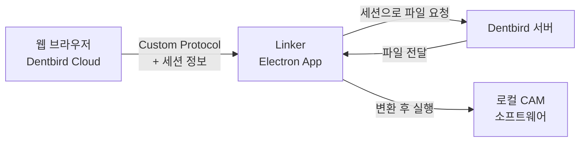
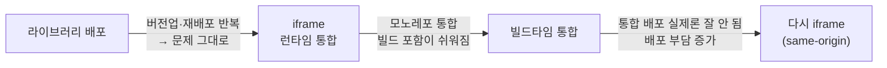
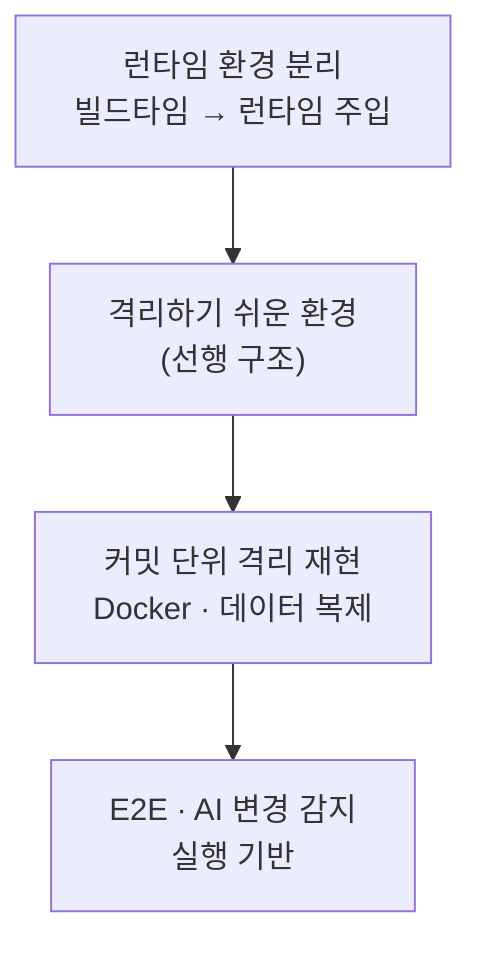
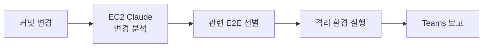

# 김진완 포트폴리오 | Frontend Developer

> **제품의 구조와 품질을 책임지는 프론트엔드 개발자**
> 화면 구현을 넘어 Electron 데스크톱·빌드 인프라·통합 아키텍처까지, 문제를 어떤 대안들 사이에서 어떻게 결정했는지를 중심으로 정리한 케이스 스터디입니다.

- [이력서](resume.html) · [경력기술서](career-description.html) · [블로그](https://velog.io/@crowwan) · [깃허브](https://github.com/crowwan)

---

## Case 1. 웹과 로컬 CAM을 잇는 Electron 데스크톱 앱 — Dentbird Linker

웹 브라우저에서 로컬에 설치된 CAM 소프트웨어를 제어해야 하는데, 브라우저는 보안상 로컬 네트워크 접근을 막습니다. 이 통신 문제를 풀고, 앱의 빌드·배포 인프라까지 처음부터 책임진 프로젝트입니다.

### 배경 (WHY)

Dentbird에서 만든 케이스를 외부 CAM으로 보내려면 다운로드·압축 해제·수동 투입을 거쳐야 했고, **자체 로컬 서버가 없는 CAM은 연동 자체가 불가**했습니다. 게다가 Chrome의 **LNA(Local Network Access)** 정책이 웹→로컬 통신을 차단해, 권한 팝업을 놓친 사용자의 CS 문의가 급증했습니다. "지금 되는 방법"을 고르면 정책이 강화될 때 또 막히는 구조였습니다.

### 접근 (HOW) — 대안 비교와 결정

**AI를 활용해 LNA 우회 20여 방안을 폭넓게 탐색**하고, 구현 속도가 아니라 장기 안정성을 기준으로 비교했습니다.

| 방안 | 검토 결과 |
|------|-----------|
| WebSocket 로컬 서버 | 구현이 가장 빠르나, "곧 LNA 적용 예정"이라 1~2년 후 재차단될 단기 해법 → **탈락** |
| HTTPS 로컬 서버 / Extension / WebRTC / mDNS / QUIC 등 | 인증서·배포·NAT 등 별도 부담 |
| **Custom Protocol** | HTTP 요청이 아니라 LNA 적용 대상이 아님 → **채택** |

Custom Protocol을 **중간 레이어**로 두어, 브라우저가 프로토콜로 Linker를 실행하며 세션 정보를 넘기면 Linker가 서버에서 파일을 직접 받아 변환 후 CAM을 실행하도록 재설계했습니다. 기존 로컬 서버 방식은 걷어냈습니다. 이질적인 외부 CAM들의 좌표계·전달 방식 차이는 **하나의 변환·연동 인터페이스로 추상화**했습니다.

명확한 스펙이 없던 외부 연동은, 기존 export 기능을 **특성화 테스트로 고정하고 구현으로 통과**시키는 전략을 썼습니다 — 버그 수정이 곧 살아있는 스펙이 됐습니다.

빌드·배포 인프라도 함께 재설계했습니다. 담당자 PC와 인프라팀(코드사인 USB)에 묶여 있던 구조를, 본인 PC를 self-hosted 빌드머신으로 세우고 GitHub Actions로 이관해 끊어냈습니다. 개발 중 *코드 서명을 빌드 뒤 따로 하면 자동 업데이트가 깨진다*는 걸 직접 부딪혀 배우고, 서명을 빌드 과정에 포함하는 구조로 정리했습니다.

### 결과 (RESULT)

- 권한 팝업을 놓쳐 발생하던 통신 차단 CS 유형을 **구조적으로 제거**
- 자체 로컬 서버가 없는 CAM까지 연동 범위 확장
- 빌드를 **20분대 → 6분**으로 단축하고, 빌드의 담당자·인프라팀 의존 제거

### 내 기여 범위

Electron 아키텍처 설계, LNA 대응 의사결정, 통신·변환 파이프라인 구현, 빌드·배포 인프라 재설계를 **주도**(POC는 타인, 프로덕션화는 본인)했습니다. 빌드 인프라는 Batch·Linker 공통으로 본인이 최다 기여자입니다. Linker는 이후 Solutions 모노레포로 통합돼 동일 구조 위에서 운영 중입니다.

---

## Case 2. 공통 모듈 통합과 전략의 진동 — Micro Frontend

4개 서비스가 공유하던 공통 기능을 모듈화하면서, **"정답 기술"을 찾는 대신 그때의 조직·배포 제약에 맞는 통합 전략을 거듭 다시 고른** 과정입니다.

### 배경 (WHY)

cloud·crown·modeler·milling이 도메인도 관리팀도 분리된 상황에서, 공통 기능 4개(설정·내보내기·탐색기·뷰어)는 공유되고 있었습니다. 이 기능이 하나 바뀔 때마다 **각 서비스에 같은 수정을 반복하고 전부 배포**해야 했고, viewer는 크라운팀이 관리하는 vtk 라이브러리에 묶여 있었습니다.

### 접근 (HOW) — 써보고 뺀 판단

먼저 컴포넌트를 **라이브러리로 배포**해봤지만, 각 서비스가 버전을 올리고 다시 배포해야 해서 풀려던 문제가 그대로 남았습니다. 그래서 런타임 통합으로 방향을 틀어, 가장 빠르고 단순한 **iframe + postMessage**를 택했습니다.

**Module Federation**도 후보였습니다. 다만 notification 기능에서 직접 도입해본 경험상 초기 설정이 복잡하고 모노레포가 아닌 소비처에서 설정 부담이 커서 이 건에서는 제외했습니다 — 몰라서가 아니라 **써보고 트레이드오프로 뺀** 판단입니다. (console-client에는 Module Federation을 직접 적용했습니다.)

가장 흥미로운 건 그 다음입니다. 4개 앱이 한 모노레포로 합쳐지자 빌드에 넣기 쉬워져 **빌드타임 통합**으로 옮겼지만, 막상 운영해보니 통합 배포가 실제로는 잘 이뤄지지 않았고 사내 배포 프로세스가 짧은 주기 배포를 어렵게 바뀌면서 배포 부담이 커졌습니다. 그래서 **다시 iframe 런타임 통합으로 회귀**하되, 이번엔 cloud 도메인 하위 same-origin으로 서빙해 CORS·인증 공유·origin 검증을 단순화했습니다.

### 결과 (RESULT)

- 4개 모듈의 변경을 **각 서비스에 반복하던 작업을 모듈 한 곳 수정으로** 좁힘
- iframe의 비용(로딩 지연, 라이브러리 중복 로딩, postMessage의 File/Blob 제한)까지 직접 확인하며 통합 전략의 트레이드오프를 체득

### 내 기여 범위

초기 4개 공통 모듈의 **iframe 런타임 통합을 주도**했고, console-client의 Module Federation 설정을 담당했습니다. 사내 3D 라이브러리→Three.js 전환은 팀 주도(vtk vendor lock-in 해소)이며, 본인은 **Viewer 렌더링 정합·회귀 수정을 담당**(현재 진행)합니다. (번들 절감 수치는 팀 차원의 전환 결과로, 본 케이스의 정량 성과로 포함하지 않습니다.)

---

## Case 3. 런타임 환경 분리 & 격리 재현 인프라

테스트·디버깅의 신뢰성 문제를 "테스트를 더 짜는" 대신 **재현 가능한 환경을 만드는 방향**으로 풀고, 그 전제가 되는 선행 구조부터 깐 프로젝트입니다.

### 배경 (WHY)

모노레포 이관 중, dev·qa에서는 멀쩡하던 것이 **prod 배포 시 dev 환경변수가 박힌 채 배포**되는 일이 있었습니다. 그 결과 배포 직후 곧바로 핫픽스를 다시 배포하는 일이 반복됐습니다. 동시에 특정 시점의 버그를 재현하기 어려웠고, E2E가 환경 차이로 쉽게 깨졌습니다.

### 접근 (HOW) — 선행 구조 먼저

원인은 **빌드 시점에 환경변수가 번들에 박히는 구조**였습니다. 이를 **런타임 주입**으로 바꾸는 작업을 팀과 공동 설계했고, 그 결과 같은 번들 하나를 dev·qa·prod에 그대로 올리고 환경 설정만 갈아끼우는 방식이 가능해졌습니다. 기준 도메인 하나에서 backend·gateway·테넌트 호스트 등 수십 개의 URL이 자동으로 파생되도록 했습니다.

이 런타임 분리가 다음 단계를 열었습니다. 환경이 런타임에 결정되니, **특정 커밋 시점으로 Docker를 띄워 그때의 클라이언트+서버 환경을 그대로 재현**하는 격리 환경을 쌓을 수 있었습니다. 핵심은 격리 환경을 바로 만든 게 아니라, 런타임 config·앱 통합으로 *"격리하기 쉬운 환경"* 을 먼저 깔고 그 위에 쌓았다는 점입니다.

### 결과 (RESULT)

- 같은 번들 재사용으로 환경별 빌드를 없애고, **배포 직후 핫픽스 반복을 해소**
- 격리 E2E 셋업을 상태 보존 서비스 공유 모델로 바꿔 **약 32분 → 3~5분**(팀 RFC)으로 단축
- 환경 차이로 깨지던 E2E를 안정적인 기반 위로 옮겼고, 이 인프라가 이후 E2E·AI 변경 감지 자동화의 실행 기반으로 확장

### 내 기여 범위

런타임 분리는 **핵심 설계에 참여**(팀 공동), 그 위의 격리 재현 환경 구축은 **주도**했습니다(첫 기동 단순화, 격리 E2E 회귀 가드, 로컬 SQS 에뮬레이터 등).

---

## Case 4. AI 변경 감지 E2E — 바뀐 코드만 골라 테스트한다

전체 E2E를 매번 돌리면 느리고, 안 돌리면 회귀를 놓칩니다. 이 이분법 대신 **"변경과 관련된 테스트만 골라 실행"** 하는 중간 해법을, Case 3의 격리 재현 인프라 위에 올린 프로젝트입니다.

### 배경 (WHY)

격리 환경 위에 E2E를 깔았지만, 매 커밋마다 전체 스위트를 돌리기엔 피드백이 느렸습니다. 그렇다고 수동으로 "이번 변경엔 이 테스트만" 고르는 것은 사람이 매번 판단해야 해 지속되기 어려웠습니다. 회귀를 **같은 PR 안에서** 잡으려면 빠르고 자동화된 선별이 필요했습니다.

### 접근 (HOW)

EC2에 Claude를 상주시켜, 커밋의 변경 내용을 분석하고 **변경과 관련된 E2E만 선별해 실행**한 뒤 결과를 Teams로 보고하는 파이프라인을 설계했습니다. 검증을 10분 주기로 자동화하고, 동시 실행·중복 분석을 막아 안정적으로 돌도록 했습니다.

### 결과 (RESULT)

- 전수 실행 대신 **변경 연관 테스트만 선별 실행**해 피드백 주기를 앞당기고, 회귀를 조기에 탐지
- 사람이 매번 "어떤 테스트를 돌릴지" 판단하던 수동 작업을 제거
- 이후 **EC2 보안 정책·스케줄 안정성의 한계**를 겪고 로컬 데일리 E2E 워크플로로 재편 — 구축·운영·한계까지 직접 겪은 과정 자체가 자산

### 내 기여 범위

커밋 변경 분석 → 테스트 선별 → 실행 → 보고 파이프라인을 EC2 위에 직접 설계·구축했고, Case 3의 격리 재현 인프라를 실행 기반으로 활용했습니다.

---

## 함께 보기

- **[이력서](resume.html)** — 전체 경력과 기술 스택
- **[경력기술서](career-description.html)** — 프로젝트별 상세
- **[깃허브](https://github.com/crowwan)** · **[블로그](https://velog.io/@crowwan)**
