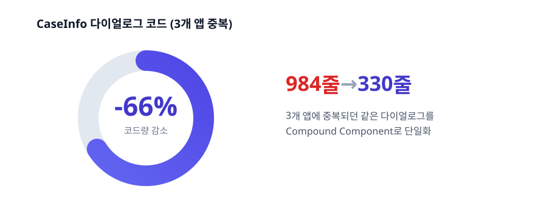
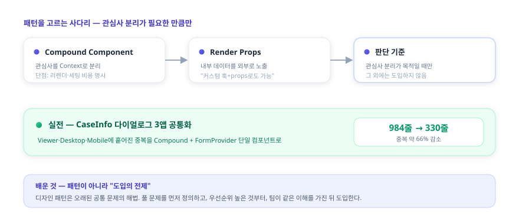
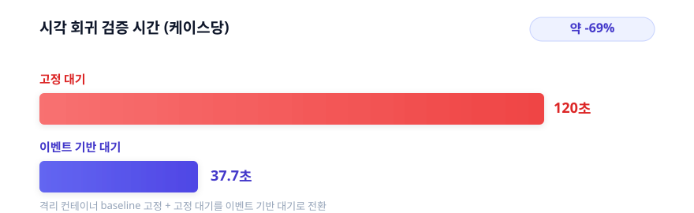
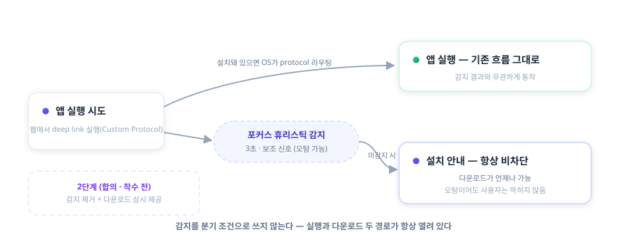
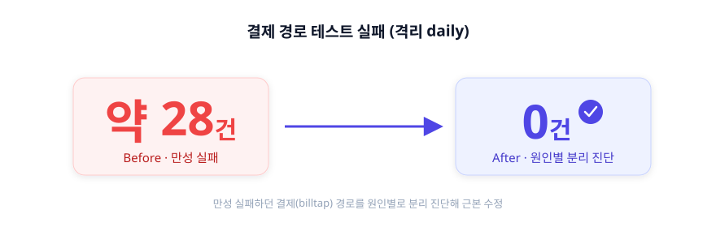
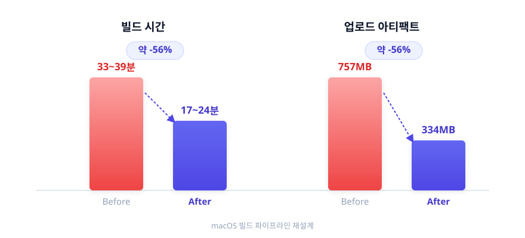
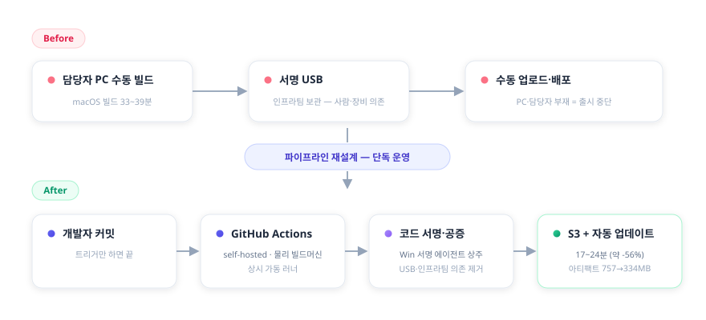

# 김진완 포트폴리오 | Frontend Engineer

- [이력서](resume.html) · [블로그](https://crowwan.github.io/) · [깃허브](https://github.com/crowwan)

---

## About

2023년 9월부터 이마고웍스에서 AI 기반 치과 CAD/CAM SaaS인 **Dentbird**의 프론트엔드를 맡고 있습니다. 구독·결제, 3D 뷰어, 외부 CAM 연동처럼 외부 의존이 많은 복잡한 화면을 만들고, AI로 코드가 빠르게 바뀌는 환경에서도 안전하게 개발할 수 있도록 아키텍처·디자인 패턴·상태관리와 검증 체계를 설계하는 것이 일의 중심입니다. 동시에 그 프론트엔드를 받치는 모노레포·환경 분리·빌드·품질 자동화 같은 플랫폼 토대까지 한 제품 안에서 폭넓게 다뤄 왔습니다. 아래는 그중 대표적인 작업들의 배경·판단·회고입니다.

---

## Skills

React
TypeScript
Next.js
TanStack Query
Three.js
Electron
Playwright
Jest
Docker
AWS
GitHub Actions
Datadog

---

## 계정·구독 클라이언트 아키텍처 — FSD·컴포넌트 패턴과 도입 기준

`2023.09 ~ 2025.07` · `React · TypeScript · FSD`

> **성과** — 3개 앱에 중복되던 CaseInfo 다이얼로그를 Compound Component로 단일화해 약 66%(984→330줄) 감소, FSD·디자인 패턴의 도입 기준을 팀에 정립

{.diagram}

### 문제

계정·구독 클라이언트를 입사 초기부터 오래 맡았는데, 클라이언트 코드에 **구체적인 컨벤션이 부족했습니다** — 언제 훅으로 빼고 언제 컴포넌트로 둘지, 파일을 어디 두고 중복을 어떻게 처리할지에 대한 명확한 기준이 없었습니다. `components`·`hooks` 같은 **역할 단위 폴더**라 만들기는 쉬웠지만, 그 훅이 어디서·왜 쓰이는지 한눈에 안 보였고 **같은 목적의 코드가 분산돼** 있었습니다. 폴더 구조를 여러 번 바꿔 봐도 기준이 없으니 곧 원형으로 돌아갔고, 에러 처리 기준도 없어 **한 기능의 에러가 전체 페이지를 중단시키고 전부 unknown으로 일괄 처리됐습니다.**

### 해결 — 구조·패턴·에러 처리를 함께 정리

마침 구독제로 전환하며 **기존 로직과 분리된 기능을 새로 시작할 기회**가 생겨, 팀과 공감대를 이뤄 처음으로 FSD를 도입했습니다.

- **FSD**로 폴더 역할과 도메인 데이터를 분리하고, API는 `{Domain}API` + query key factory, DTO↔도메인은 mapper로 가르는 규칙을 정립했습니다.
- **Compound Component·Render Props**로 관심사를 분리하되, 단점(Context 리렌더 비용, "커스텀 훅+props로도 된다")까지 기록하고 **관심사 분리가 목적일 때만 쓴다**는 기준을 세웠습니다.
- **선언적 에러 처리**로 전환 — `if (!data) return null` 방어를 ErrorBoundary로 바꾸되 모든 곳에 두지 않고 **장애 허용 범위를 화면 단위로 설계**했고, HTTP 200으로 오는 비즈니스 에러는 `BusinessLogicError`로 코드별 분기했습니다.
- **서버/클라이언트 상태 분리** 컨벤션(TanStack Query data를 useState로 복제하지 않기 등)을 팀 규칙으로 정의했습니다.

이 기준을 적용한 예가 둘 있습니다. **Compound Component** — 3개 앱에 중복되던 CaseInfo 다이얼로그를 Compound + FormProvider 단일 컴포넌트로 추출해 약 66%(984→330줄) 줄였습니다. **Render Props** — 통신 방식(Custom Protocol↔HTTP)을 나중에 한쪽으로 굳히기 쉽도록 전환 지점만 추상화하되, 약간의 중복은 의도적으로 허용해 *얼마나 추상화할지*를 문제에 맞춰 골랐습니다.

{.diagram}

### 회고

돌아보면 한계가 분명했습니다. FSD를 도입했는데도 `widgets`·`pages`처럼 **UI 단위가 레이어에 섞여** "이 파일을 어디 넣지"가 안 풀렸고, 그걸 정하느라 작은 논의가 끊이지 않았습니다 — 위치 고민을 줄이려 도입했는데 정작 그 지점을 못 풀었습니다. 디자인 패턴도 "코드 일관성"이라는 명분으로 굳이 안 써도 되는 곳에 적용한 경우가 많았고, 제가 제안한 방향을 팀원들이 다르게 이해해 같은 패턴인데 쓰는 방법이 제각각이 되기도 했습니다. 가장 크게 깨달은 것은, 디자인 패턴은 오랜 기간 누적된 공통 문제를 푸는 해법인데 저는 그 패턴이 어떤 문제를 푸는지 정확히 이해하지 못한 채 도입했다는 것입니다.

그래서 지금은 기술을 도입할 때 **가장 우선순위 높은 문제를 먼저 정의**하고, 대안을 비교해 맞을 때만 **팀이 같은 이해를 가진 상태에서** 도입합니다. 효용만이 아니라 **도입 비용(커뮤니케이션·마이그레이션·과도기 복잡도)까지 따져**봐야 한다는 것도 이때 배웠습니다. 구조 자체가 나빴던 것은 아닙니다 — 그 코드는 이후 모노레포로 옮겨가서도 그대로 살아남았습니다. 배운 건 '좋은 구조'가 아니라 **'도입의 전제'**였습니다.

---

## 케이스 목록 썸네일 로딩 최적화 — 지연 로딩·요청 배치·실패 캐싱

`2025.10 ~ 2026.06` · `React · TanStack Query · IntersectionObserver · Context API`

> **성과** — 운영 중 발생한 무한 재요청 회귀를 공유 캐시 구조로 근절(재마운트돼도 중복 fetch 없음을 회귀 테스트로 고정), 썸네일을 지연 로딩 + 요청 배치로 최적화해 "N장 = N요청" 구조를 해소

### 문제

케이스 목록은 사용자가 가장 자주 보는 화면이고 썸네일이 수십 장 표시되는데, "N장 = 네트워크 N요청"이 되기 쉽습니다. 게다가 운영 중 깜빡임과 무한 재요청이 발생했습니다. 무한 재요청의 원인은 **카드가 재마운트될 때마다 훅이 새로 생겨 같은 썸네일을 중복 요청**하고, 403 같은 영구 오류도 새 URL로 계속 다시 호출하는 구조였습니다.

### 해결

**IntersectionObserver로 viewport에 들어온 썸네일만 로드**하고, 50ms 윈도우 안의 요청을 모아 **한 번에 배치 요청**하는 공통 훅(Context Provider 기반)을 만들었습니다.

무한 재요청은 **캐시를 카드 바깥 Provider로 끌어올려 모든 카드가 공유**하게 하고, **성공(4분)뿐 아니라 실패(10초)도 캐시**해 풀었습니다 — 영구 오류를 짧게 기억해두면 재마운트돼도 네트워크를 다시 호출하지 않고 즉시 "No data"로 처리됩니다. 그 위에 단일 마운트 안의 `onError` 폭주를 억제하는 재시도 1회 클램프를 보조 장치로 두었고, **"성공 시 errorCount를 리셋하면 같은 영구 오류가 다시 반복된다"는 이유로 의도적으로 리셋하지 않았습니다**. 깜빡임은 로딩 상태를 첫 fetch에만 토글하고 재시도는 silent로 처리해 제거했습니다. 회귀 테스트로 "같은 Provider 안에서 재마운트돼도 중복 fetch 없음"을 검증합니다.

{.diagram}

### 회고

무한 재요청은 재시도 횟수만 제한해도 멈출 수는 있습니다. 하지만 그건 증상이고, 진짜 원인은 **카드가 재마운트될 때마다 훅이 새로 생겨 캐시가 소실되고 같은 오류를 다시 호출하는 구조**였습니다. 그래서 재시도 클램프는 보조로만 두고, 캐시를 카드 바깥 Provider로 끌어올려 구조 자체를 고쳤습니다. 다만 재마운트 자체를 없애는 건 더 큰 공사라, 거기까진 가지 않고 **공유 캐시로 우회하는 실용적 선택**을 했습니다 — 증상을 덮을지 구조를 고칠지 그 사이에서, 비용 대비 효과가 가장 큰 지점을 고른 작업이었습니다.

설계에서 하나 더 신경 쓴 건 실패를 다루는 방식입니다. 보통 캐시는 성공만 담지만, 여기서는 403 같은 영구 오류도 짧게(10초) 캐시했습니다. 실패를 기억하지 않으면 재마운트마다 같은 오류를 다시 호출하기 때문입니다 — 성공뿐 아니라 실패도 하나의 상태로 보고 캐싱한 것이 무한 재요청을 끊은 핵심이었습니다.

---

## B2B 구독·결제 프론트엔드 — 예측 가능/불가능 에러 분리

`2023.09 ~ 2025.07` · `React · TypeScript · TanStack Query`

> **성과** — 모든 에러를 한 덩어리로 처리하던 구조를 예측 가능/불가능 에러로 분리해, 한 기능의 실패가 전체 페이지를 중단시키지 않도록 개선(BusinessLogicError·ErrorBoundary 체계는 모노레포 이관 후에도 존속)

### 문제 — 모든 에러가 한 덩어리였다

일회성 크레딧에서 반복 구독으로 전환하는 시점에 구독·결제 화면(플랜 업그레이드·좌석 구매·취소·재개·쿠폰·결제수단·히스토리)을 전담했습니다 — 결제 인프라와 팝업 앱 기반은 팀과 함께였습니다. 그런데 당시 회사에는 에러 처리에 대한 정의가 없었습니다. 사실 지금도 그렇습니다. 모든 에러를 하나의 unknown으로 일괄 처리하다 보니, 한 기능에서 발생한 에러가 전체 페이지를 에러 화면으로 바꿨습니다. 케이스 리스트 조회 한 번 실패하면 SNB도 대시보드도 접근하지 못했습니다.

근본 원인은 예측 가능한 에러와 예측 불가능한 에러를 구분하지 않은 것이었습니다. 구분이 없으니, 서버가 의도적으로 내려준 비즈니스 에러든 정말 예상하지 못한 시스템 실패든 똑같이 폴백 UI로 처리돼버렸습니다.

### 해결 — 에러를 둘로 나누다

예측 불가능한 에러는 ErrorBoundary로 격리했습니다. 컴포넌트마다 분산된 명령형 방어 코드 `if (!data) return null`을 ErrorBoundary로 대체하고, 어디까지 실패를 허용할지를 도메인 의존 관계로 구분했습니다. billing 정보를 받지 못해도 결제 내역 조회·구독 취소·뒤로가기는 살아남습니다. 한 기능의 실패가 전체 페이지를 중단시키지 않습니다.

예측 가능한 에러는 코드별로 분기했습니다. 서버는 비즈니스 에러를 `HTTP 200 · success:false · errorCode` 형태로 내려줍니다. 이건 실패가 아니라 의도된 결과라 폴백 UI로 뭉뚱그리면 안 됩니다. `BusinessLogicError` 커스텀 클래스로 throw하고, `.when(errorCode, action).otherwise()` 체인으로 에러 코드별로 분기했습니다.

{.diagram}

### 회고

에러 처리의 출발점은 정교한 도구가 아니라 에러를 구분 짓는 일이라는 걸 이 프로젝트에서 배웠습니다. 예측 가능한 실패와 불가능한 실패를 나누지 않으면, 아무리 잘 만든 ErrorBoundary를 두어도 결국 다 같은 폴백으로 처리됩니다.

이 구조는 모노레포로 이관된 뒤에도 `BusinessLogicError`와 `withErrorBoundary` HOC로 살아남았습니다. 다만 조직 차원의 에러 처리 정의는 여전히 없고, 무엇이 실패해도 무엇은 살아남아야 하는가를 결제 데이터 의존 관계까지 끊어내는 설계는 당시 출시 우선순위와 설계 역량의 한계로 끝까지 가지 못했습니다. 이 문제의식은 이후 관측·복원력 표준화에서 조직 차원으로 이어갔습니다.

또 패턴과 설계는 팀 전체의 공통 이해가 없으면 복잡도만 높인다는 것도 이때 배웠습니다. 에러 응답 형식만 해도 서버가 HTTP 200에 success:false로 내려줄지 4xx·5xx로 내려줄지부터 백엔드와 합의가 필요했고, 이 약속을 미리 맞춰두지 않으면 응답마다 어떻게 처리할지 다시 논의하는 비용이 계속 쌓였습니다.

---

## 관측·복원력 표준화 — 5개 앱 에러 추적·복원

`2026.04 ~` · `React · TypeScript · Datadog RUM`

> **성과** — RUM에서 한 줄로 뭉쳐 보이던 실패 124건을 원인별로 추적 가능하게 직렬화, 5개 앱 에러 처리를 공통 표준으로 정렬

### 문제

에러는 잡히지만 **어디서 왜 났는지 추적되지 않았습니다**. 여러 fail mode가 같은 UI·같은 메시지로 뭉개져, 예컨대 QA 환경 RUM에서 124건의 실패가 `new Error('failedToExportMeshes')` **한 줄로 collapse**되어 원인 추적이 불가능했습니다.

### 해결

- **Root → Section → Feature 3계층 ErrorBoundary 체계를 설계**해 에러를 계층별로 격리하고, 5개 앱을 공통 표준으로 정렬했습니다(계층 적용 깊이는 앱별 단계적).
- 에러를 **Datadog 관측 표준에 맞춰 직렬화**해, 한 메시지로 뭉쳐 보이던 실패 124건을 원인별로 추적 가능하게 만들었습니다. 적용 전후는 **격리 환경에서 RUM 데이터를 정량 비교**해 검증했습니다.
- **안전망은 발생 위치만 자동 표기**하고 의미 부여는 호출자가 명시하도록 책임을 분리했으며, 최상위 안전망에는 외부 의존을 두지 않아 **안전망이 자기 의존성 때문에 실패하지 않도록** 설계했습니다.

{.diagram}

render-time 에러는 `react-error-boundary`로 처리하지만, **비동기 에러에는 이 라이브러리를 쓰지 않았습니다** — ① 실제 실패는 렌더가 아니라 **async 이벤트 핸들러**(파일 다운로드·파싱)에서 나는데 이 라이브러리는 render-time 에러만 잡고, ② iframe 안 모듈의 boundary는 host까지 전파되지 않으며, ③ throw 지점마다 wrap 코드가 늘어 피하려던 분기 증식이 반복되기 때문입니다. 대신 비동기 에러는 **에러 객체 자체에 풍부한 metadata를 담는** 방식(표준 `Error.cause` + 구조화된 실패 상세)을 택해, throw 지점은 한 줄로 두고 RUM에는 grep 가능한 단일 라인으로 직렬화했습니다. 공통 라이브러리라 **한 곳을 고치면 5개 앱에 반영**됩니다.

에러를 `instanceof`로 — axios·fetch 같은 특정 라이브러리의 에러 타입으로 — 판별하면 라이브러리마다 타입이 달라 분기가 복잡해지고 그 라이브러리에 종속됩니다. 대신 에러 객체의 **형태(shape)만 보고 HTTP 상태를 추출**해, axios·fetch·커스텀 wrapper 어디서 온 에러든 같은 기준으로 다뤘습니다. 이렇게 뽑은 상태로 에러를 일시적 오류·치명적 오류·무시할 오류 등 여섯 갈래로 나눠 분류별로 다르게 대응했고, 이 분류 로직은 한 앱에서 만든 뒤 공통 라이브러리로 옮겨 여러 앱이 함께 쓰게 했습니다.

같은 복원력 관점을 데이터 로딩으로도 확장하려 합니다 — 3D 뷰어에서 여러 design 중 일부 mesh가 손상돼도 `Promise.allSettled`로 **살아있는 mesh는 렌더하고 누락은 ModelTree에 표시**해, "전부 실패"와 "부분 실패"를 하나의 흐름에서 가르는 방향을 제안했습니다(착수 전). 에러 바운더리를 모든 곳에 두는 대신 **장애 허용 범위를 화면이 직접 설계한다**는 원칙을 데이터 흐름에 적용하려는 구상입니다.

### 회고

관측은 에러를 *잡는* 일이 아니라 *왜 났는지 추적할 수 있게* 만드는 일이라는 걸 이 프로젝트에서 분명히 했습니다. 한 줄로 뭉쳐 보이던 124건을 원인별로 가른 것이 그 출발이었습니다.

안전망 설계에서 가장 크게 배운 건, 최후 안전망일수록 외부 의존이 없어야 한다는 점입니다. 처음엔 ErrorBoundary의 fallback UI에 회사 디자인 시스템을 그대로 썼는데, 디자인 시스템에 큰 변경이 생기자 그 fallback UI 자체가 에러를 발생시키며 흰 화면만 남았습니다 — 사용자를 마지막에 받아내야 할 안전망이 자기 의존성 때문에 무너진 것입니다. 그래서 최상위 fallback은 의존성을 최대한 제거한 UI로 다시 만들어 가장 바깥 레이어에 뒀습니다.

직접 만든 7분류 에러 체계가 특정 앱에 치우쳐 있던 것도 인정하고 팀 공통 표준에 맞춰 폐기·정렬했습니다. 직접 만든 걸 고집하기보다 팀 표준으로 맞추는 게 관측의 가치를 살린다고 봤습니다.

---

## 3D 렌더링 품질 — 마이그레이션 부채 정리와 시각 회귀 테스트

`2026.04 ~` · `Three.js · draco3d · WebGL · Playwright · pngjs`

> **성과** — 시각 회귀 검증을 이벤트 기반 대기로 바꿔 케이스당 120초 → 37.7초, 이미지 맞춤 미세조정 약 1,420줄을 Three.js 표준 기능으로 정리

{.diagram}

> 🖼️ **[이미지]** 같은 치아 모델을 두 엔진으로 렌더한 결과 비교 + 시각 회귀 CI의 RED/GREEN 스크린샷 diff 예시.

### 문제

사내 3D 라이브러리를 Three.js로 옮기는 마이그레이션을 **팀이 AI 기반으로 빠르게 진행**하면서, "기존과 똑같이 보이게" 두 엔진의 렌더 결과 이미지를 비교해 맞추다 보니 **색·조명이 특정 미세조정 값에 기대어** 구현된 부분이 남았습니다. 이런 코드는 조건이 조금만 바뀌어도 쉽게 어긋납니다. 게다가 3D 렌더 회귀는 일반적인 Playwright 픽셀 비교로는 GPU 차이에 묻혀 잘 잡히지 않았습니다.

### 해결

- **미세조정 값 → 표준 기능으로 대체** — 이미지 맞춤으로 들어간 색·조명 값을 원본 엔진의 실제 동작·구현을 근거로 Three.js 표준 기능으로 1:1 대체했습니다. 미세조정 값·메인 스레드 디코더 등 약 1,420줄을 정리했습니다.
- **소스 엔진을 역추적해 표준 기능으로 매핑** — 보철이 스캔 위에 겹쳐 보이는 'z-fighting'을 처음엔 레이어 순서 문제로 보고 튜닝했지만, 한쪽 mesh를 그리지 않는 실험으로 **겹친 geometry가 근본 원인**임을 확정했습니다. 원본 엔진이 왜 depth를 직접 미는 방식을 썼는지(16비트 depth 정밀도 한계)까지 코드로 이해한 뒤, GLSL을 새로 쓰는 대신 Three.js 표준 기능(displacementMap으로 vertex를 균일하게 미세 inflate)으로 같은 효과를 냈습니다. 썸네일이 본 화면과 미묘하게 다르던 것도 'legacy 픽셀을 맞추려 남긴 보정값 몇 개'가 그사이 통일된 기준과 갈라진 것이라 같은 원칙으로 정리했습니다.
- **시각 회귀를 결정적으로 측정** — 처음엔 채널별 평균 픽셀 차이를 metric으로 정의한 도구를 만들었지만, 평균값 비교는 국소적 깨짐을 놓치는 한계가 있었습니다. 이후 **격리 컨테이너에서 baseline을 고정 생성**(소프트웨어 렌더러로 CI·로컬 GPU 차 제거)하고 **Playwright 스크린샷 비교**로 검증하는 방식으로 발전시켰고, 고정 대기 대신 **이벤트 기반 대기로 바꿔 케이스당 검증 시간을 120초에서 37.7초로** 줄였습니다.

겹친 면의 좌표 충돌(z-fighting)을 새 GLSL을 쓰지 않고 Three.js 표준 `displacementMap`으로 풀고, opaque/transparent로 갈라져 있던 정책을 모드 무관 단일 정책으로 통합했습니다. 이 함수 한 곳만 고치면 모든 호출처가 자동으로 맞춰집니다.

### 검토 후 보류한 결정 — 그리고 뒤집힌 전제

VTK는 modeler·crown·milling의 핵심 렌더 엔진인데, 그중 **썸네일 생성 부분만 Three.js로 통합하자는 제안**이 있었습니다. VTK는 어차피 핵심 엔진으로 남아 있어 썸네일만 옮겨도 **번들 감소가 0**임을 소비처를 grep해 확인했고, 저장 후 재캡처는 mesh를 다시 받는 왕복이 늘어 **악화 방향**임을 코드 경로로 확인했습니다. "안 하는 게 낫다"를 데이터로 정당화하고, *"생성은 VTK / 사후 재캡처는 Three.js"*라는 책임 경계로 정리했습니다.

이 경계는 약 일주일 뒤 **전제가 바뀌며 수명을 다했습니다** — 썸네일 생성이 서버로 오프로드되면서(Node 환경엔 canvas가 없어 VTK가 빈 이미지를 생성함) 팀이 batch 썸네일을 Three.js로 완전 통합했습니다. '안 하는 결정'은 그 시점의 전제에 묶인 판단이고, 전제가 바뀌면 다시 뒤집는 게 맞다는 것까지 포함해 기록으로 남겼습니다.

### 회고 · 기여 경계

마이그레이션 자체는 팀이 AI로 주도했고, 본인 기여는 **그 결과물의 이미지 맞춤 부채를 식별·정리하고 회귀를 검증**(현재 진행)하는 부분입니다. (번들 절감 같은 전환 수치는 팀 차원의 성과로, 본 케이스의 정량 성과로 포함하지 않습니다.) 교훈은 분명합니다 — **결과 이미지를 맞추는 빠른 마이그레이션은 미세조정에 기대 취약하고, 소스 엔진의 동작을 이해해 타깃 엔진의 표준 기능으로 옮겨야 오래간다.**

---

## 기업 랜딩 풀스택 — 타입세이프 i18n으로 번역 오류 차단

`2023.09 ~ 2025.10` · `Next.js · i18n · Fastify · MongoDB`

> **성과** — 타입세이프 i18n으로 번역 키 오류를 런타임이 아닌 빌드 타임에 차단, 성능·SEO를 포함한 기업 랜딩 v3를 풀스택 단독 리뉴얼

### 문제

입사 첫 업무로 기업 랜딩을 단독 리뉴얼해 이후 2년 넘게 화면부터 서버 API까지 풀스택으로 운영했는데, 번역 키 오타가 **런타임에야 드러나서** 잘못된 키나 누락된 키가 배포 후에야 발견되곤 했습니다.

### 해결

영어 단일 소스에서 **타입을 자동 생성**해, 없는 키를 **컴파일 타임에 차단**하는 타입세이프 i18n으로 전환했습니다. 키를 추가·삭제할 때 누락이 빌드에서 바로 검출됩니다.

영어 로케일(`locales/en`)을 단일 소스로 타입 정의를 자동 생성하고, 그 타입을 i18next에 주입해 **존재하지 않는 키는 `t('...')` 호출 시 컴파일 에러**가 나게 했습니다. 키를 추가·삭제하면 `tsc --noEmit`에서 바로 검출됩니다.

### 회고

"런타임에야 드러날 문제를 빌드 타임으로 당긴다"는 원칙은 이후 결제·테스트·관측까지 제가 일하는 방식의 공통 축이 됐습니다.

다만 타입 체크가 만능은 아니라는 것도 뒤늦게 배웠습니다. 같은 방식을 본 앱에도 넓힐지 검토하며 그동안의 i18n 버그를 직접 집계해보니, 정작 가장 흔한 '번역 키 노출'은 영어 단일 소스로 만든 타입 체크가 잡지 못하는 사각지대였습니다 — 언어별 키 누락이라, 더 싸고 정확한 건 언어 간 키 parity 체크였습니다. 도구는 좋아 보이는가가 아니라 무엇을 막는가를 데이터로 따져 선택해야 한다는 걸, 제가 도입했던 방법을 스스로 점검하며 확인했습니다.

---

## 웹·로컬 CAM 연동 Electron 데스크톱 앱 — Dentbird Linker

`2024.07 ~ 2025.12, 이후 단독 운영` · `Electron · React · TypeScript · Datadog`

> **성과** — 좌표계·전달 방식이 제각각인 외부 CAM 12종을 단일 연동 인터페이스로 통합, 제각각이던 설치 감지 타임아웃을 3초로 맞추고 비차단 안내로 통일

### 문제

Dentbird에서 디자인한 보철 케이스를 사용자 PC의 **외부 CAM 소프트웨어**로 보내는 사내 연동 앱(Linker)을 단독 설계·운영했습니다. 연동은 **파일을 전달하는 데이터 채널**과 **앱 설치·실행 여부를 아는 감지 채널**의 두 축으로 나뉘는데, 이 케이스는 그 둘을 모두 다룹니다. 기존에는 케이스를 외부 CAM으로 보내려면 **다운로드 → 압축 해제 → 수동 투입**을 거쳐야 했고, 자체 로컬 서버가 없는 CAM은 연동 자체가 불가능했습니다. 게다가 Chrome의 **LNA(Local Network Access)** 정책이 웹→로컬 통신을 차단하면서, 권한 팝업을 놓친 사용자의 CS 문의가 늘었습니다. "지금 되는 방법"을 고르면 정책이 강화될 때 또 막히는 구조였습니다.

### 해결 — 대안 비교 후 장기 안정성 기준 선택

여러 통신 방식을 구현 속도가 아니라 **장기 안정성** 기준으로 비교했습니다.

| 방안 | 검토 결과 |
|------|-----------|
| WebSocket 로컬 서버 | 구현은 가장 빠르나 곧 LNA 적용 대상 → 1~2년 후 재차단될 단기 해법, **탈락** |
| HTTPS 로컬 서버 | 인증서·배포 부담 + 같은 LNA 사정 → **탈락** |
| **Custom Protocol** | HTTP 요청이 아니라 LNA 적용 대상이 아님 → **채택** |

Custom Protocol을 **중간 레이어**로 두어, 브라우저가 프로토콜로 Linker를 실행하며 세션 정보를 넘기면 Linker가 서버에서 파일을 직접 받아 변환 후 CAM을 실행하도록 재설계했습니다. 좌표계·전달 방식이 제각각인 **외부 CAM 12종**(프로세스 실행 방식 8종 + 포트 연동 방식 4종)의 차이는 **하나의 변환·연동 인터페이스로 추상화**했습니다.

{.diagram}

운영 중 발생하던 정체불명의 'unknown error' 모달도 추측으로 고치지 않았습니다. **Datadog 로그 시퀀스로 초기 가설(요청 페이로드 문제)을 반증**하고, 실제 원인이 변환 대상에 잘못 섞여 들어간 point cloud 파일임을 로그로 확정해 좁혔습니다.

명세가 없던 외부 export는 **기존 동작 자체를 명세로 삼았습니다** — CAM으로 보내는 시점의 STL byte snapshot(크기·sha256)을 그 자리에서 기록해 특성화(characterization) 테스트로 고정한 뒤, 구현을 그 테스트에 통과시키는 방식으로 안전하게 재구현했습니다. `processExportSession`이 전송 직후 임시 STL을 지우기 때문에, 단언 시점이 아니라 mock 구현 안에서 즉시 읽어 둡니다.

CAM 12종을 모두 설치하지 않고도 연동·자동 업데이트를 검증하려고, 케이스 상단의 **Mock Server**를 만들었습니다. CAM의 헬스체크·파일 핑 같은 엔드포인트와 자동 업데이트 응답을 흉내 내고, **성공·에러(500)·지연·타임아웃·부분 실패** 시나리오를 버튼으로 전환해 Linker가 각 상황에서 어떻게 동작하는지 재현했습니다.

### 설치 감지 — 감지를 믿지 않는 방향으로

두 번째 축인 감지 채널입니다. 브라우저는 LNA 정책 때문에 로컬 헬스체크로 앱 실행을 직접 확인할 수 없어, 창 포커스 변화 같은 **휴리스틱으로 추정**할 수밖에 없습니다. 그래서 두 방향의 오탐이 있었습니다.

- **false-negative** — 앱이 **이미 실행 중**이면 OS가 기존 창으로 라우팅해 포커스 변화가 안 생겨 '미설치'로 오인 → 설치돼 있는데 설치 모달이 뜸
- **false-positive** — 로딩 중 사용자가 **DevTools를 열어** 포커스가 빠지면 '설치됨'으로 오인 → 미설치인데 다운로드 안내가 억제됨

감지를 완벽하게 만들려 하지 않고, **틀려도 사용자가 막히지 않는** 쪽으로 정책을 통일했습니다. batch 2.5초·Linker 10초로 제각각이던 감지 타임아웃을 **3초로 맞추고**, 3초 내 미감지면 미설치로 간주하되 **설치 안내를 항상 비차단(non-trapping)으로 표시해** 어떤 경우에도 다음 행동(다운로드)이 가능하게 했습니다. DevTools로 인한 false-positive는 타임아웃으로 막지 못하는 한계임을 **인지한 채 수용**했습니다.

{.diagram}

이건 1단계입니다. 근본 해법으로는 — Zoom·Slack 같은 설치형 서비스처럼 — **감지 판정 자체를 없애고 다운로드 안내를 항상 제공하되 설치돼 있으면 자동 실행되는 방식**을 직접 제안해 기획·QA와 합의했고, 아직 착수 전입니다. 휴리스틱 위에 보강을 더하는 방식으로는 구조적 한계를 넘지 못한다는 것을, 같은 자리가 다시 열리며(reopen) 배웠습니다.

### 회고

처음엔 로컬 서버 방식이 핵심이었지만 정책 변화로 수명이 다했고, 직접 폐기한 뒤 Custom Protocol 기반으로 옮겼습니다. "되는 방법"이 아니라 "오래 버티는 방법"을 고른 판단이 이 프로젝트의 핵심이었습니다.

감지에서도 같은 태도를 얻었습니다. 브라우저 정책상 앱 실행 여부를 정확히 알 수 없어 휴리스틱은 늘 틀릴 수 있는데, 감지를 완벽하게 만들려 애쓰기보다 틀려도 사용자가 막히지 않도록 설계하는 쪽이 더 단단했습니다. 나아가 감지 판정 자체를 없애는 방향까지 제안하게 된 것은, 휴리스틱 위에 보강을 더하는 방식으로는 구조적 한계를 넘지 못한다는 것을 같은 문제가 다시 열리며 겪었기 때문입니다.

(Linker·Batch를 아우르는 LNA 대응 흐름은 팀과 함께였고, 본인 기여는 Linker 앱의 설계·구현·운영과 감지 정책 통일, 그리고 2단계 방향 제안입니다.)

---

## 공통 모듈 Micro Frontend — 제약 기반 통합 전략

`2023.09 ~ 2025.10` · `NX · Module Federation`

> **성과** — 4개 서비스에 중복되던 공통 기능 4종을 same-origin iframe 단일 구현으로 통합해 4개월간 유지

{.diagram}

### 문제

4개 서비스(cloud·crown·modeler·milling)가 공유하던 공통 기능 4개(설정·내보내기·탐색기·뷰어)는, 하나 바뀔 때마다 **각 서비스에 같은 수정을 반복하고 전부 배포**해야 했습니다. 도메인도 관리팀도 분리돼 있어 변경 한 번의 비용이 컸습니다.

### 해결 — 써보고 뺀 판단의 연속

{.diagram}

먼저 컴포넌트를 **라이브러리로 배포**했지만 각 서비스가 버전업·재배포를 반복해야 해 문제가 그대로 남았습니다. 그래서 가장 빠르고 단순한 **iframe + postMessage** 런타임 통합으로 전환했습니다. 4개 앱이 한 모노레포로 합쳐지자 **빌드타임 통합**으로 옮겼지만, 막상 통합 배포가 실제로는 잘 이뤄지지 않았고 사내 배포 주기 제약으로 부담만 커졌습니다. 그래서 **다시 iframe으로 회귀**하되, 이번엔 same-origin으로 서빙해 CORS·인증 공유·origin 검증을 단순화했습니다.

**Module Federation**도 후보였지만, 다른 기능에 도입해본 경험상 초기 설정이 복잡하고 모노레포가 아닌 소비처에서 부담이 커 이 건에서는 제외했습니다 — 몰라서가 아니라 **써보고 트레이드오프로 뺀** 판단입니다. (console-client에는 Module Federation을 직접 적용했습니다.)

### 회고

같은 문제를 라이브러리 → iframe → 빌드타임 통합 → 다시 iframe으로 세 번 다르게 풀었습니다. iframe 통합과 console-client의 Module Federation은 제가 주도했고, 빌드 도구 전환은 팀과 함께였습니다. 매번 그때 더 낫다고 본 방법을 택했지만, 운영해보면 조직·배포 제약이 다른 답을 가리켰습니다 — 빌드타임 통합은 기술적으로 깔끔했어도 사내 배포 주기와 맞지 않아 결국 same-origin iframe으로 돌아왔습니다. 이 과정에서 **"정답 기술"은 없고 제약에 맞는 선택만 있다는 것, 더 나아 보이는 방법도 운영해보기 전엔 모른다는 것**을 배웠습니다. 이 통합은 4개월간 공통 기능 4종을 단일 구현으로 유지했고, 이후 팀이 Vite로 표준을 통일하며 그쪽으로 정리됐습니다.

---

## 프론트엔드 모노레포 통합 — 레포·환경 구성 일원화

`2024.06 ~` · `TypeScript · NX · Git Subtree · i18n`

> **성과** — 별도 레포의 앱 2종·라이브러리 6종을 커밋 이력 보존하며 NX 모노레포로 이관, 잔존 설정이 유발하던 OOM을 진단해 빌드 태스크 11 → 9로 정리

### 문제

별도 레포로 분산돼 있던 클라이언트 앱·공용 라이브러리가 환경별 URL·도메인을 **각자 다르게 구성**하고 있었고, 공통 변경을 여러 곳에 반복해야 했습니다. 다국어 관리도 중복 업로드와 분산된 스크립트로 파편화돼 있었습니다.

### 해결

- **NX 유지 + OOM 해소** — 모노레포 도구를 새로 고르는 대신 기존 NX를 유지했습니다. 전환 이득이 이관·재학습 비용을 넘지 못한다고 봤기 때문입니다. 잔존하던 `webpack.config.js`가 NX 자동 타겟 추론을 유발해 불필요한 빌드 산출물과 OOM을 일으키던 것을 진단해, **빌드 태스크를 11개에서 9개로 줄이고 OOM을 해소**했습니다.
- **Git Subtree로 이관** — 별도 레포의 클라이언트 앱 2종·공용 라이브러리 6종을 메인 NX 모노레포로 옮겼습니다. 단순 복사가 아니라 **커밋 이력을 보존**하고 네임스페이스 충돌을 리네임으로 해소했습니다.
- **도메인 통합 라이브러리** — 환경별로 분산된 도메인·URL 구성을 단일 라이브러리로 일원화했습니다. 기준 도메인 하나에서 backend·gateway·테넌트 호스트 등이 한 곳에서 파생됩니다. (팀의 런타임 환경 분리·격리 재현 환경이 이 라이브러리를 기반으로 동작합니다.)
- **다국어 중앙화** — 중복 업로드 89줄과 14개 스크립트로 분산된 i18n 관리를 단일 스크립트로 모았습니다.

{.diagram}

기준 도메인(통합/레거시) 하나에서 cloud·accounts·api URL이 모두 파생됩니다. 통합 도메인에서는 상대 경로로, 레거시에서는 환경변수 기반 절대 URL로 갈라지되 호출부는 `UrlHelper.cloud()` 한 형태로 통일됩니다.

### 회고

분산됐던 레포를 하나로 합치니, 여러 곳에 걸친 변경을 한 PR에서 한눈에 보고 리뷰할 수 있게 됐습니다. npm 패키지나 외부 모듈로 따로 배포되며 버전이 어긋나 생기던 불일치도, 빌드 타임에 함께 컴파일하는 방식으로 사라졌습니다. "무엇을 합칠까"보다 합친 뒤에도 흔들리지 않을 토대 — 도메인 통합 라이브러리 — 를 먼저 마련한 것이, 다음 단계인 격리 재현 환경의 기반이 됐습니다.

---

## 격리 재현 환경과 AI 변경 감지 — 결정론적 테스트 인프라

`2025.11 ~` · `Docker · MongoDB · 런타임 Config · Playwright · EC2 · Claude · qase`

> **성과** — 만성 실패하던 결제 경로 테스트를 원인별로 분리 진단해 28건 → 0, E2E 로그인 중복을 공통 헬퍼로 약 93% 감소, 커밋 단위 격리 재현 위에 AI 변경 감지 파이프라인 구축

{.diagram}

### 문제

테스트·디버깅의 신뢰성이 이 프로젝트의 출발점이었습니다. dev·qa에서는 멀쩡하던 것이 **prod 배포 시 dev 환경변수가 포함된 채 배포**되는 일이 있었고, 그 결과 배포 직후 곧바로 핫픽스를 다시 배포하는 일이 반복됐습니다. 동시에 특정 시점의 버그를 재현하기 어려웠고, E2E가 다른 변경의 간섭으로 쉽게 흔들렸습니다.

### 해결 — 선행 구조 먼저, 그 위에 격리

원인은 **빌드 시점에 환경변수가 번들에 고정되는 구조**였습니다. 런타임 분리 자체는 팀이 진행했고, 본인은 그 토대로 **도메인 통합 라이브러리**를 구축했습니다. 환경이 런타임에 결정되니, **특정 커밋 시점으로 Docker를 기동해 그때의 클라이언트 + 서버 + DB를 그대로 재현**하는 격리 환경을 구축할 수 있었습니다.

{.diagram}

핵심은 격리 환경을 바로 만든 게 아니라, *"격리하기 쉬운 환경"*을 먼저 구축하고 그 위에 격리 환경을 구성했다는 점입니다. 이 환경은 **다른 변경의 간섭 없이 특정 시점을 결정론적으로 재현**하는 것을 목표로 합니다.

### 결과

- 본인이 구축한 도메인 통합 토대 위에서 팀의 런타임 분리가 맞물려 환경별 빌드가 사라지고 **배포 직후 핫픽스 반복이 해소**됐고, 본인은 그 위에 격리 재현 환경을 직접 구축
- 격리 이전에 분산돼 있던 E2E부터 정리했습니다 — 백오피스 전 영역에 수십 개 suite를 구축하고 로그인 중복을 공통 헬퍼로 **약 93% 줄였으며**, 인라인 셀렉터를 Page Object로 리팩토링했습니다. 이렇게 안정화한 E2E를 격리 기반 위로 옮겨, 아래 AI 변경 감지의 실행 기반으로 삼았습니다
- 만성적으로 실패하던 격리 daily는 **원인별로 분리 진단**했습니다. **결제(billtap) 경로 실패 약 28건을 근본 수정해 0으로** 만들었고, **8개 앱 동시 기동 시 S3 다운로드가 DNS를 포화**시키던 문제를 수정 유/무 대조 실행으로 확정해 공유 캐시 프리페치(1회 워밍)로 해소했습니다 — 처음엔 포트 문제로 의심했으나, 같은 대조 실행으로 직접 반증했습니다.

### 그 위에 — 바뀐 코드만 골라 테스트한다 (AI 변경 감지)

전체 E2E를 매번 돌리면 느리고, 안 돌리면 회귀를 놓칩니다. 이 이분법 대신 **"변경과 관련된 테스트만 골라 실행"**하는 중간 해법을 격리 인프라 위에 올렸습니다. 시작은 수백 개 qase 테스트 케이스를 사람이 일일이 검증하기 어렵다는 문제를 **Planner·Verifier 2-에이전트로 자동 검증**하던 도구(TC-Verify)였고, 이를 "변경 연관 테스트 선별"로 확장한 것입니다.

**EC2에서 Claude를 상시 구동**해, 커밋 diff를 분석하고 **QA팀이 관리하는 qase 테스트 케이스 중 연관 케이스를 선별·실행**한 뒤 결과를 Teams로 보고하고, **실패를 실제 회귀와 테스트 코드 문제로 1차 분류**하는 파이프라인을 설계했습니다. 검증은 **10분 주기 크론잡**으로 자동화하고, 동시 실행·중복 분석을 막아 안정적으로 돌도록 했습니다.

{.diagram}

단순한 테스트 코드 문제(셀렉터 변경 등)와 실제 API 회귀를 **1차로 갈라**, 사람이 확인할 것만 추려 보고하도록 했습니다. 핵심은 AI를 코드 자동완성 같은 보조 도구가 아니라 **"어떤 테스트가 이 변경에 필요한가"라는 판단 단계**에 결합했다는 점입니다.

### 회고

"왜 내 PC에선 되는데 CI에선 안 되지"를 매번 디버깅하는 대신, 그 질문 자체가 나오지 않는 환경을 만드는 게 목표였습니다. 도구가 아니라 **결정성**이 핵심이었습니다.

격리 환경과 2주간 겪은 시행착오를 17건·약 36시간으로 직접 집계해 보니, 문제는 환경이 불안정해서가 아니라 **같은 환경을 두 목적(빌드본 그대로 검증 vs 방금 고친 코드 swap)으로 쓰면서 한쪽엔 결정성이 오히려 독이 됐기** 때문이었습니다. 그래서 두 모드를 명시적으로 분리하는 결정을 남겼습니다 — 결정성은 절대선이 아니라 용도에 따라 양날이라는 것을, 운영 피로를 데이터로 환산해 확인했습니다.

AI 변경 감지에는 한계도 있습니다. 선별·분류는 1차 판단이라 사람의 확인이 필요하고, EC2 보안 정책·스케줄 안정성의 운영 부담을 줄이려 이후 로컬 데일리 E2E 워크플로로 옮기고 있습니다. 선별 정확도·실행량 절감 같은 정량 효과는 아직 측정 근거가 없어, 성과로 부풀리지 않고 메커니즘과 한계만 적어 둡니다. 더 본질적으로는, 어떤 회귀가 **AI 리뷰가 오히려 통과시킨** 잘못된 테스트에서 비롯됐습니다 — 기획 의도가 코드·테스트에 반영되지 않고 티켓 코멘트에만 있던 탓에 맥락을 모르는 변경이 잘못된 동작을 E2E 단언으로 굳혔고, 그 PR은 사람 리뷰어 없이 AI 승인만 받은 상태였습니다. 직접 바로잡았지만, AI를 판단 단계에 넣을수록 그 판단이 맥락 없이 틀릴 수 있다는 것까지 함께 설계해야 합니다.

---

## 데스크톱 앱 빌드·서명·배포 자동화 — 로컬 빌드·수동 서명 의존 제거

`2024 ~` · `Electron · electron-builder · electron-updater · GitHub Actions · Azure Pipelines · S3`

> **성과** — 데스크톱 앱 빌드 시간 33~39분 → 17~24분(약 -56%), 업로드 아티팩트 757MB → 334MB, Windows 코드 서명을 빌드머신 단독 운영으로 전환(인프라팀 의존 제거)

{.diagram}

### 문제

두 데스크톱 앱(Batch·Linker)의 빌드·서명·배포 파이프라인은, 빌드가 담당자 로컬 PC에서 돌고 코드 서명이 인프라팀의 USB에 묶여 있어 **그 PC나 담당자가 자리를 비우면 출시가 멈추는** 구조였습니다.

- macOS 빌드가 길고, 빌드가 특정 담당자 PC에 종속돼 있었습니다.
- Windows 코드 서명은 인프라팀이 보관한 **서명 USB**가 있어야만 가능해, 매 배포마다 사람과 장비에 의존했습니다.

### 해결

빌드를 **물리 빌드머신 + self-hosted GitHub Actions**로 옮기고, **Windows 코드 서명 에이전트를 빌드머신에 직접 설치·풀 등록**해 단독 운영하도록 만들었습니다. 서명 USB와 인프라팀 의존을 끊은 것입니다. macOS 파이프라인은 빌드 단계를 재설계해 **전체 33~39분 걸리던 빌드를 17~24분으로** 줄였습니다(약 -56%, 업로드 아티팩트 757MB→334MB).

{.diagram}

### 되돌린 결정과 도입하지 않은 결정

이 프로젝트에는 **도입했다가 회수한 결정**과 **검토 끝에 도입하지 않은 결정**이 함께 있습니다.

- **macOS 아키텍처 번복** — Universal → arm64 → 다시 Intel로 **11일간 3연속 번복**했습니다. 용량이 2배가 되는 트레이드오프를 도입·운영·회수까지 직접 감당하며, 아키텍처 결정이 용량·호환성·배포에 어떻게 번지는지 직접 겪으며 배웠습니다.
- **빌드 과정 내 코드 서명 통합은 도입하지 않음** — 원래는 빌드 안에서 서명까지 끝내는 게 정석입니다. 저는 한발 더 나아가 **인프라팀 개입 없이 개발자가 배포 준비가 끝난 아티팩트를 자율적으로 빌드**하고, 그걸 넘겨 서명 후 자동 업데이트까지 동작하는 흐름을 만들려 했습니다. 그러나 **서명 후 바이너리가 바뀌면 체크섬이 어긋나 자동 업데이트가 실패하는** 문제를 확인하고, 오히려 더 번거로워질 것으로 판단해 도입하지 않았습니다.
- **blue-green 무중단 배포** — 도입했으나, green 검증 자동화는 환경·빌드가 2배가 되는 운영 비용 대비 가치가 낮다고 보아 보류했습니다.

### 회고

운영하면서 두 장애도 직접 겪었습니다. 상시 가동 self-hosted 러너가 빌드 tarball을 `/tmp`에 남기는데 정리에서 누락돼 나흘간 738개·약 26GB가 쌓여 8개 앱 빌드가 전부 멈춘 적이 있습니다 — `/` 디스크는 여유였는데 `/tmp`만 별도 RAM 파티션이라 놓쳐 진단이 늦었고, 정리 스텝을 산출물 생성과 대칭으로 맞춰 근본 해결했습니다. GitHub Actions 이관 중에는 Windows 서명 도구 압축 해제가 심볼릭 링크 권한 부족으로 조용히 5회 실패하던 것을 러너 Developer Mode로 풀었습니다.

자동 업데이트가 조용히 실패하던 문제를 추적하다, 무결성 검증이 "빌드 시점에 기록된 해시 = 실제 바이너리 해시"라는 전제 위에 선다는 걸 알게 됐습니다. 증상이 아니라 **전제를 건드리는 결정**(어디서 서명할 것인가)이 곧 업데이트 안정성을 좌우합니다.

---

## 함께 보기

- **[이력서](resume.html)** — 전체 경력과 기술 스택
- **[깃허브](https://github.com/crowwan)** · **[블로그](https://crowwan.github.io/)**
