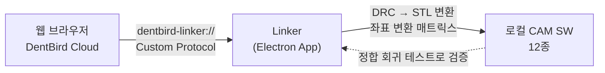
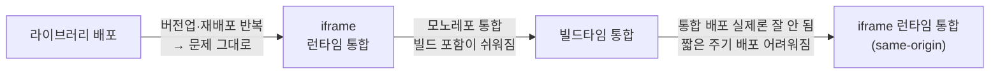
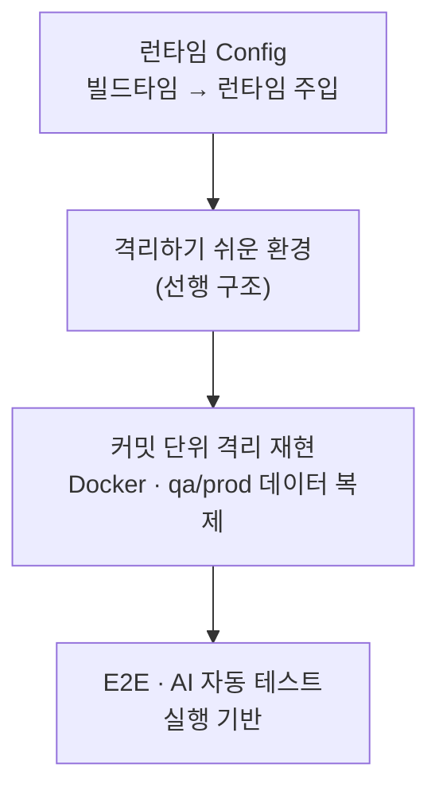

# 김진완 포트폴리오 | Frontend Developer

> **제품의 구조와 품질을 끝까지 책임지는 프론트엔드 개발자**
> 화면 구현을 넘어 Electron 데스크톱·빌드 인프라·통합 아키텍처까지, 문제를 어떤 대안들 사이에서 어떻게 결정했는지를 중심으로 정리한 케이스 스터디입니다.

- [이력서](resume.html) · [경력기술서](career-description.html) · [블로그](https://velog.io/@crowwan) · [깃허브](https://github.com/crowwan)

---

## Case 1. DentBird Linker — 웹과 로컬 CAM을 잇는 Electron 데스크톱 앱

*판단 · 효율 · 범위*

웹 브라우저에서 로컬에 설치된 CAM 소프트웨어를 직접 제어해야 하는데, 브라우저는 보안상 로컬 네트워크 접근을 막습니다. 이 통신 문제를 풀고, 앱의 빌드·배포 인프라까지 0→1로 책임진 프로젝트입니다.

### 배경 (WHY)

클라우드 CAD에서 설계한 결과물을 사용자 PC의 CAM 소프트웨어로 보내야 했지만, Chrome의 **Local Network Access(LNA)** 정책이 웹→로컬 통신을 차단했습니다. 단순히 "지금 되는 방법"을 고르면 정책이 다시 강화될 때 또 막히는 구조였습니다.

### 접근 (HOW) — 대안 비교와 결정

LNA를 우회할 여러 방안을 놓고, **구현 속도가 아니라 장기 안정성**을 기준으로 비교했습니다.

| 방안 | 검토 결과 |
|------|-----------|
| WebSocket 로컬 서버 | 구현은 가장 빠르나, 향후 LNA 재차단 가능성으로 **탈락** |
| HTTPS 로컬 서버 / Chrome Extension / WebRTC / mDNS | 각각 인증서·배포·NAT 등 별도 부담 |
| **Custom Protocol** | 브라우저 정책 변화에 덜 취약 → **채택** |

`dentbird-linker://` 딥링크로 웹과 데스크톱 앱을 잇고, 그 위에 DRC→STL 실시간 변환 파이프라인을 올렸습니다. CAM마다 좌표계가 달라 생기는 정합 오류는 **변환 매트릭스 알고리즘**으로 흡수하고, CAM별 회귀 테스트로 검증했습니다.

빌드·배포 인프라도 함께 재설계했습니다. 빌드 담당자 PC와 인프라팀(코드사인 USB)에 묶여 있던 구조를, 본인 PC를 self-hosted 빌드머신으로 세우고 GitHub Actions로 이관해 끊어냈습니다. 개발 중에는 *코드사인을 빌드 이후에 따로 하면 바이너리 checksum이 바뀌어 자동 업데이트가 깨진다*는 점을 직접 부딪혀 배웠고, 코드사인을 빌드 과정에 포함하는 구조로 정리했습니다.

### 결과 (RESULT)

- **12종 CAM 소프트웨어** 어디로 내보내도 좌표 오류 없이 동작
- 한 달여 만에 v1.0.3까지 프로덕션 릴리스
- 빌드 시간을 **20분대에서 6분 내외로** 단축(체감), 빌드 속인성·인프라팀 의존 제거
- QA/PROD 채널 분리로 잘못된 빌드 수신 사고 차단

### 내 기여 범위

Electron + Vite + React 아키텍처 설계, LNA 대응 의사결정, 통신·변환 파이프라인 구현, 빌드·배포 인프라 재설계를 **주도**했습니다. (Batch·Linker 두 앱의 인프라는 팀 작업이며 본인이 최다 기여자입니다.)

---

## Case 2. Micro Frontend — 공통 모듈 통합과 전략의 진동

*구조 · 판단*

4개 서비스가 공유하던 공통 기능을 모듈화하면서, **"정답 기술"을 찾는 대신 그때의 조직·배포 제약에 맞는 통합 전략을 거듭 다시 고른** 과정입니다.

### 배경 (WHY)

cloud·crown·modeler·milling이 도메인도 관리팀도 분리된 상황에서, 공통 기능 4개(setting·export·explorer·viewer)는 공유되고 있었습니다. 이 기능이 하나 바뀔 때마다 **각 서비스에 같은 수정을 반복하고 전부 배포**해야 하는 비용이 문제였습니다.

### 접근 (HOW) — 써보고 뺀 판단

먼저 컴포넌트를 **라이브러리로 배포**해봤지만, 결국 각 서비스가 버전을 올리고 다시 배포해야 해서 풀려던 문제가 그대로 남았습니다. 그래서 런타임 통합으로 방향을 틀었고, 그중 가장 빠르고 단순한 **iframe + postMessage(typed, same-origin)** 를 택했습니다.

**Module Federation**도 후보였습니다. 다만 notification 기능에서 직접 도입해본 경험상 초기 설정이 복잡하고 모노레포가 아닌 소비처에서 설정 부담이 커서 이 건에서는 제외했습니다 — 몰라서가 아니라 **써보고 트레이드오프로 뺀** 판단입니다. (별도로 console-client에는 Module Federation을 직접 적용했습니다.)

가장 흥미로운 건 그 다음입니다. 4개 앱이 한 모노레포로 합쳐지자 빌드에 넣기 쉬워져 **빌드타임 통합**으로 옮겼지만, 막상 운영해보니 통합 배포가 실제로는 잘 이뤄지지 않았고 사내 배포 프로세스가 짧은 주기 배포를 어렵게 바뀌면서 배포 부담이 커졌습니다. 그래서 **다시 iframe 런타임 통합으로 회귀**하되, 이번엔 모듈별 도메인 대신 cloud 도메인 하위 same-origin으로 서빙해 CORS·인증 공유·origin 검증을 단순화했습니다.

### 결과 (RESULT)

- 4개 모듈의 변경을 **각 서비스에 반복하던 작업을 모듈 한 곳 수정으로** 좁힘
- iframe의 비용(로딩 지연, 라이브러리 중복 로딩, postMessage의 File/Blob 제약)까지 직접 확인하며, 통합 전략의 트레이드오프를 체득

### 내 기여 범위

초기 4개 공통 모듈의 **iframe 런타임 통합을 주도**했고, console-client의 Module Federation 설정을 담당했습니다. (이후 iwtk→Three.js 전환과 그 번들 절감 수치는 팀 차원의 작업으로, 본 케이스의 정량 성과로 포함하지 않습니다.)

---

## Case 3. 런타임 환경 분리 & 격리 재현 인프라

*효율 · 구조*

테스트·디버깅의 신뢰성 문제를 "테스트를 더 짜는" 대신 **재현 가능한 환경을 만드는 방향**으로 풀고, 그 전제가 되는 선행 구조부터 깐 프로젝트입니다.

### 배경 (WHY)

모노레포 이관 중, dev·qa에서는 멀쩡하던 것이 **prod 배포 시 엉뚱한 환경으로 요청을 보내거나 환경변수 파일이 누락**되는 일이 있었습니다. 그 결과 배포 직후 곧바로 핫픽스를 다시 배포하는 일이 반복됐습니다. 동시에 특정 시점의 버그를 재현하기 어려웠고, E2E가 환경 차이로 쉽게 깨졌습니다.

### 접근 (HOW) — 선행 구조 먼저

원인은 환경변수를 **빌드타임에 박아 넣는 구조**였습니다. 이를 **런타임 주입**으로 바꾸는 설계에 참여했고, 그 결과 같은 빌드 결과물 하나를 dev·qa·prod에 그대로 올리고 환경변수만 갈아끼우는 방식이 가능해졌습니다.

이 런타임 분리가 다음 단계를 열었습니다. 환경이 런타임에 결정되니, **특정 커밋 시점으로 Docker를 띄워 그때의 클라이언트+서버 환경을 그대로 재현**하는 격리 환경을 쌓을 수 있었습니다. 핵심은 격리 환경을 바로 만든 게 아니라, 런타임 config·앱 통합으로 *"격리하기 쉬운 환경"* 을 먼저 깔고 그 위에 쌓았다는 점입니다.

### 결과 (RESULT)

- 같은 빌드 결과물 재사용으로 환경별 빌드 시간 절감, **배포 직후 핫픽스 반복을 해소**
- qa/prod의 특정 데이터를 격리 환경에 복제해 **그 시점을 그대로 재현**하는 신뢰도 높은 디버깅 환경 구축
- 환경 차이로 깨지던 E2E를 안정화하고, 이 인프라가 이후 **E2E·AI 변경 감지 자동화의 실행 기반**으로 확장

### 내 기여 범위

런타임 config(빌드타임→런타임 주입)는 **핵심 설계에 참여**(팀 공동), 그 위의 격리 재현 환경 구축은 **주도**했습니다(첫 기동 단순화, 격리 E2E 회귀 가드, 로컬 SQS 에뮬레이터 등).

---

## 함께 보기

- **[이력서](resume.html)** — 전체 경력과 기술 스택
- **[경력기술서](career-description.html)** — 프로젝트별 상세
- **[깃허브](https://github.com/crowwan)** · **[블로그](https://velog.io/@crowwan)**
