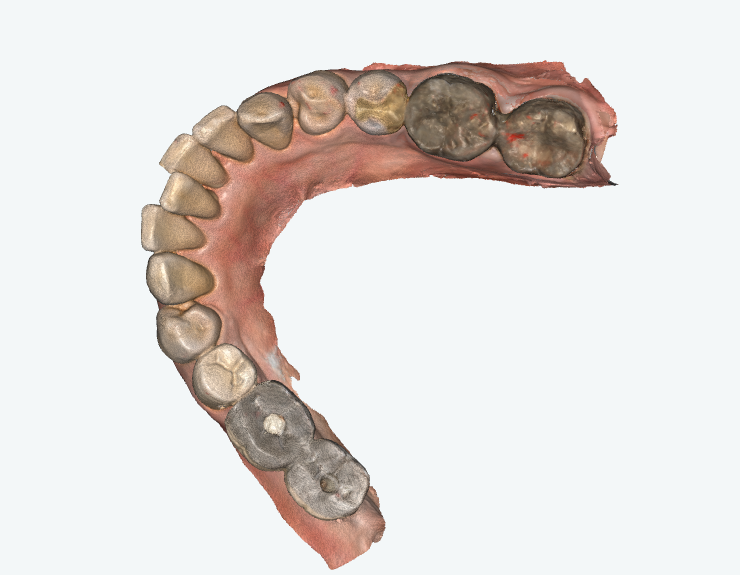
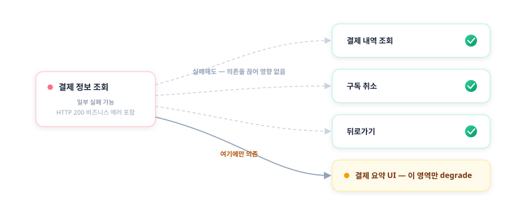

# 김진완 포트폴리오 | Frontend Developer

> **Dentbird의 프론트엔드를 맡아 웹·데스크톱 앱부터 모노레포·환경 분리 같은 플랫폼 토대, 빌드·배포, 품질 자동화까지 담당했습니다.**
>
> 브라우저 보안 정책에 막힌 웹↔로컬 연동을 Custom Protocol로 재설계하고, 담당자 PC에 묶여 있던 데스크톱 빌드를 자동화 파이프라인으로 옮겼으며, 테스트가 거의 없던 제품에 격리 재현 환경을 만들고, 그 위에 AI로 변경을 감지하는 회귀 검증 체계를 설계했습니다.
>
> 기술은 당장 빠른 것보다 오래 버티는 것을 기준으로 고르려 했고, 한 번 정한 뒤에도 운영하며 한계를 만나면 다시 설계했습니다. 그 과정에서 되돌린 결정과 도입하지 않은 결정도 정직하게 적었습니다.

- [이력서](resume.html) · [블로그](https://velog.io/@crowwan) · [깃허브](https://github.com/crowwan)

---

## About

2023년 9월부터 이마고웍스에서 AI 기반 치과 CAD/CAM SaaS인 **Dentbird**의 프론트엔드를 맡고 있습니다. 웹·Electron 데스크톱 앱 구현부터 모노레포 통합·런타임 환경 분리·빌드/배포·품질 자동화까지, 한 제품 안에서 폭넓게 전담해 왔습니다.

**Skills**

- **Language / UI** — TypeScript, JavaScript · React 18/19, Next.js · MUI, Emotion · TanStack Query, Recoil
- **Desktop** — Electron (IPC, Deep Link, Custom Protocol, Auto Update, Code Signing)
- **Build / Arch** — NX, pnpm, Git Subtree, Module Federation, iframe + postMessage, 런타임 Config
- **3D / Graphics** — Three.js, WebGL, draco3d, SRGB ColorManagement
- **Quality / Infra** — Playwright, Jest, Vitest, MSW, qase · GitHub Actions(self-hosted), Docker, AWS(EC2/S3) · Datadog RUM/Logs



*Dentbird Cloud — 구강 스캔을 3D로 다루는 AI 기반 치과 CAD/CAM 플랫폼. 이 화면을 포함한 웹·데스크톱 프론트엔드를 담당했습니다.*

---

## Case 1. 웹과 로컬 CAM을 잇는 Electron 데스크톱 앱 — Dentbird Linker

`2024.07 ~ 2025.12, 이후 단독 운영` · `Electron · React · TypeScript · Custom Protocol · Chrome LNA · Datadog`

> 🖼️ **[이미지]** Linker 실행 흐름 — 웹에서 "CAM으로 보내기" 클릭 → Linker 실행 → CAM 소프트웨어가 케이스를 받는 장면(스크린샷 3컷 또는 짧은 GIF).

### 개요

Dentbird에서 디자인한 보철 케이스를 사용자 PC에 설치된 **외부 CAM 소프트웨어**로 보내는 사내 연동 앱(Linker)입니다. 웹 브라우저에서 로컬 소프트웨어를 제어해야 하는데, 브라우저는 보안상 로컬 네트워크 접근을 막습니다. 이 통신 문제를 풀고 앱을 단독 설계·운영했습니다. 연동은 **파일을 전달하는 데이터 채널**과 **앱 설치·실행 여부를 아는 감지 채널**의 두 축으로 나뉘는데, 이 케이스는 그 둘을 모두 다룹니다.

### 문제

기존에는 케이스를 외부 CAM으로 보내려면 **다운로드 → 압축 해제 → 수동 투입**을 거쳐야 했고, 자체 로컬 서버가 없는 CAM은 연동 자체가 불가능했습니다. 게다가 Chrome의 **LNA(Local Network Access)** 정책이 웹→로컬 통신을 차단하면서, 권한 팝업을 놓친 사용자의 CS 문의가 늘었습니다. "지금 되는 방법"을 고르면 정책이 강화될 때 또 막히는 구조였습니다.

### 해결 — 대안 비교 후 장기 안정성 기준 선택

여러 통신 방식을 구현 속도가 아니라 **장기 안정성** 기준으로 비교했습니다.

| 방안 | 검토 결과 |
|------|-----------|
| WebSocket 로컬 서버 | 구현은 가장 빠르나 곧 LNA 적용 대상 → 1~2년 후 재차단될 단기 해법, **탈락** |
| HTTPS 로컬 서버 | 인증서·배포 부담 + 같은 LNA 사정 → **탈락** |
| **Custom Protocol** | HTTP 요청이 아니라 LNA 적용 대상이 아님 → **채택** |

Custom Protocol을 **중간 레이어**로 두어, 브라우저가 프로토콜로 Linker를 실행하며 세션 정보를 넘기면 Linker가 서버에서 파일을 직접 받아 변환 후 CAM을 실행하도록 재설계했습니다. 좌표계·전달 방식이 제각각인 **외부 CAM 12종**(프로세스 실행 방식 8종 + 포트 연동 방식 4종)의 차이는 **하나의 변환·연동 인터페이스로 추상화**했습니다.

{.diagram}

운영 중 뜨던 정체불명의 'unknown error' 모달도 추측으로 고치지 않았습니다. **Datadog 로그 시퀀스로 초기 가설(요청 페이로드 문제)을 반증**하고, 실제 원인이 변환 대상에 잘못 섞여 들어간 point cloud 파일임을 로그로 확정해 좁혔습니다.

명세가 없던 외부 export는 **기존 동작 자체를 명세로 삼았습니다** — CAM으로 보내는 시점의 STL byte snapshot(크기·sha256)을 그 자리에서 박제해 특성화(characterization) 테스트로 고정한 뒤, 구현을 그 테스트에 통과시키는 방식으로 안전하게 재구현했습니다. `processExportSession`이 전송 직후 임시 STL을 지우기 때문에, 단언 시점이 아니라 mock 구현 안에서 즉시 읽어 둡니다.

```typescript
// apps/linker-desktop/tests/integration/exportSession.integration.test.ts
sendToMillBoxMock.mockImplementation(async (exportFiles) => {
  const snapshot = [];
  for (const ef of exportFiles) {
    const buffer = await fs.readFile(ef.filePath);
    snapshot.push({
      filePath: ef.filePath,
      byteLength: buffer.byteLength,
      sha256: createHash('sha256').update(buffer).digest('hex'),
    });
  }
  capturedSendToMillBoxFiles.push(snapshot);
  return { success: true };
});

it('평문 fixture 의 export 흐름은 valid STL 을 만들고 sendToMillBox 로 위임한다', async () => {
  await handleProtocolUrl(buildProtocolUrl({ sessionId, softwareId: 'MILLBOX', config }));

  expect(sendToMillBoxMock).toHaveBeenCalledTimes(1);          // CAM SW 위임 완료
  expect(capturedDialogTypes).not.toContain('export-error');   // 에러 다이얼로그 없음
  const [snapshot] = capturedSendToMillBoxFiles;               // 전송 시점 byte snapshot
  expect(snapshot[0].byteLength).toBeGreaterThanOrEqual(84);   // binary STL 최소 크기
  expect(snapshot[0].filePath.toLowerCase().endsWith('.stl')).toBe(true);
});
```

### 설치 감지 — 감지를 믿지 않는 방향으로

두 번째 축인 감지 채널입니다. 브라우저는 LNA 정책 때문에 로컬 헬스체크로 앱 실행을 직접 확인할 수 없어, 창 포커스 변화 같은 **휴리스틱으로 추정**할 수밖에 없습니다. 그래서 두 방향의 오탐이 있었습니다.

- **false-negative** — 앱이 **이미 실행 중**이면 OS가 기존 창으로 라우팅해 포커스 변화가 안 생겨 '미설치'로 오판 → 설치돼 있는데 설치 모달이 뜸
- **false-positive** — 로딩 중 사용자가 **DevTools를 열어** 포커스가 빠지면 '설치됨'으로 오판 → 미설치인데 다운로드 안내가 억제됨

감지를 완벽하게 만들려 하지 않고, **틀려도 사용자가 막히지 않는** 쪽으로 정책을 통일했습니다. batch 2.5초·Linker 10초로 제각각이던 감지 타임아웃을 **3초로 수렴**하고, 3초 내 미감지면 미설치로 간주하되 **설치 안내를 항상 비차단(non-trapping)으로 띄워** 어떤 경우에도 다음 행동(다운로드)이 가능하게 했습니다. DevTools로 인한 false-positive는 타임아웃으로 막지 못하는 한계임을 **인지한 채 수용**했습니다.

{.diagram}

이건 1단계입니다. 근본 해법으로는 — Zoom·Slack 같은 설치형 서비스처럼 — **감지 판정 자체를 없애고 다운로드 안내를 항상 제공하되 설치돼 있으면 자동 실행되는 방식**을 직접 제안해 기획·QA와 합의했고, 아직 착수 전입니다. 휴리스틱 위에 보강을 쌓는 방식으로는 구조적 한계를 못 넘는다는 걸, 같은 자리가 다시 열리며(reopen) 배웠습니다.

### 회고

처음엔 로컬 서버 방식이 핵심이었지만 정책 변화로 수명이 다했고, 직접 폐기한 뒤 Custom Protocol 기반으로 옮겼습니다. "되는 방법"이 아니라 "오래 버티는 방법"을 고른 판단이 이 프로젝트의 핵심이었습니다. (Linker·Batch를 아우르는 LNA 대응 흐름은 팀과 함께였고, 본인 기여는 Linker 앱의 설계·구현·운영과 감지 정책 통일, 그리고 2단계 방향 제안입니다.)

---

## Case 2. 담당자 PC에 묶인 데스크톱 빌드를 자동화 파이프라인으로

`2024 ~` · `Electron · electron-builder · electron-updater · GitHub Actions(self-hosted) · Azure Pipelines · 코드 서명·공증 · S3`

### 개요

두 데스크톱 앱(Batch·Linker)의 빌드·서명·배포 파이프라인입니다. 빌드가 담당자 로컬 PC에서 돌고 코드 서명은 인프라팀의 USB에 묶여 있어, **그 PC나 담당자가 자리를 비우면 출시가 멈추는** 구조였습니다.

### 문제

- macOS 빌드가 길고, 빌드가 특정 담당자 PC에 종속돼 있었습니다.
- Windows 코드 서명은 인프라팀이 보관한 **서명 USB**가 있어야만 가능해, 매 배포마다 사람과 장비에 의존했습니다.

### 해결

빌드를 **물리 빌드머신 + self-hosted GitHub Actions**로 옮기고, **Windows 코드 서명 에이전트를 빌드머신에 직접 설치·풀 등록**해 단독 운영하도록 만들었습니다. 서명 USB와 인프라팀 의존을 끊은 것입니다. macOS 파이프라인은 빌드 단계를 재설계해 **전체 33~39분 걸리던 빌드를 17~24분으로** 줄였습니다(PR 실측 약 -56%, 업로드 아티팩트 757MB→334MB).

{.diagram}

### 되돌린 결정 — 정직하게 남기는 트레이드오프

이 프로젝트에는 **도입했다가 회수한 결정**과 **검토 끝에 도입하지 않은 결정**이 함께 있습니다.

- **macOS 아키텍처 번복** — Universal → arm64 → 다시 Intel로 **11일간 3연속 번복**했습니다. 용량이 2배가 되는 트레이드오프를 도입·운영·회수까지 직접 감당하며, 아키텍처 결정이 용량·호환성·배포에 어떻게 번지는지 체득했습니다.
- **빌드 과정 내 코드 서명 통합은 도입하지 않음** — 원래는 빌드 안에서 서명까지 끝내는 게 정석입니다. 저는 한발 더 나아가 **인프라팀 개입 없이 개발자가 배포 준비가 끝난 아티팩트를 자율적으로 빌드**하고, 그걸 넘겨 서명 후 자동 업데이트까지 동작하는 흐름을 만들려 했습니다. 그러나 **서명 후 바이너리가 바뀌면 체크섬이 어긋나 자동 업데이트가 깨지는** 문제를 확인하고, 오히려 더 번거로워질 것으로 판단해 도입하지 않았습니다.
- **blue-green 무중단 배포** — 도입했으나, green 검증 자동화는 환경·빌드가 2배가 되는 운영 비용 대비 가치가 낮다고 보아 보류했습니다.

### 운영하며 만난 장애

- **빌드 머신 디스크 0 사건** — 상시 가동되는 self-hosted 러너가 빌드 산출물 tarball을 `/tmp`에도 남기는데 정리에서 누락돼, **나흘간 738개·약 26GB**가 쌓이며 8개 앱 빌드가 전부 멈췄습니다. `/` 디스크는 여유였는데 **`/tmp`만 별도 RAM 파티션(tmpfs)이라 가득 찬 것**을 놓쳐 진단이 늦었습니다. 정리 스텝을 산출물 생성과 대칭으로 맞춰 근본 해결했습니다.
- **Windows 코드 서명 권한 장벽** — GitHub Actions 이관 중 서명 도구 압축 해제가 심볼릭 링크 권한 부족으로 조용히 5회 실패했습니다. 러너에 Developer Mode를 켜고 재시작해 풀었습니다.

### 회고

자동 업데이트가 조용히 실패하던 문제를 추적하다, 무결성 검증이 "빌드 시점에 기록된 해시 = 실제 바이너리 해시"라는 전제 위에 선다는 걸 알게 됐습니다. 증상이 아니라 **전제를 건드리는 결정**(어디서 서명할 것인가)이 곧 업데이트 안정성을 좌우한다는 감각이 이 프로젝트에서 남았습니다.

---

## Case 3. 흩어진 레포를 모노레포로 — 통합과 환경 일원화

`2024.06 ~` · `TypeScript · NX · Git Subtree · i18n`

### 개요

별도 레포로 흩어져 있던 클라이언트 앱·공용 라이브러리를 하나의 NX 모노레포로 모으고, 환경별로 제각기 구성하던 도메인·URL을 일원화한 프로젝트입니다. 이후 격리 재현 환경(Case 4)이 이 토대 위에 올라갑니다.

### 문제

클라이언트 앱들이 환경별 URL·도메인을 **각자 다르게 구성**하고 있었고, 별도 레포에 흩어져 있어 공통 변경을 여러 곳에 반복해야 했습니다. 다국어 관리도 중복 업로드와 흩어진 스크립트로 파편화돼 있었습니다.

### 해결

- **Git Subtree로 이관** — 별도 레포의 클라이언트 앱 2종·공용 라이브러리 6종을 메인 NX 모노레포로 옮겼습니다. 단순 복사가 아니라 **커밋 이력을 보존**하고 네임스페이스 충돌을 리네임으로 해소했으며, 이후에도 정기 동기화를 운영했습니다.
- **도메인 통합 라이브러리** — 환경별로 흩어진 도메인·URL 구성을 단일 라이브러리로 일원화했습니다. 기준 도메인 하나에서 backend·gateway·테넌트 호스트 등이 한 곳에서 파생됩니다. (팀의 런타임 환경 분리·격리 재현 환경이 이 라이브러리를 기반으로 동작합니다.)
- **다국어 중앙화** — 중복 업로드 89줄과 14개 스크립트로 흩어진 i18n 관리를 단일 스크립트로 모았습니다.

{.diagram}

기준 도메인(통합/레거시) 하나에서 cloud·accounts·api URL이 모두 파생됩니다. 통합 도메인에서는 상대 경로로, 레거시에서는 환경변수 기반 절대 URL로 갈라지되 호출부는 `UrlHelper.cloud()` 한 형태로 통일됩니다.

```typescript
// libs/url-utils — 기준 도메인 하나에서 cloud·accounts·api URL이 모두 파생된다.
function getServiceUrl(service: 'cloud' | 'accounts', path: string = ''): string {
  if (isUnifiedDomain()) {
    // 통합 도메인: 상대 경로 (Webpack Proxy가 처리)
    if (!path) return `/${service}`;
    const normalizedPath = path.startsWith('/') ? path : `/${path}`;
    return `/${service}${normalizedPath}`;
  }
  // 레거시 도메인: 환경변수 기반 절대 URL
  const baseUrl =
    process.env[`NX_PUBLIC_${service.toUpperCase()}_URL`] ||
    `https://${service}.dentbird.com`;
  if (!path) return baseUrl;
  const normalizedPath = path.startsWith('/') ? path : `/${path}`;
  return baseUrl + normalizedPath;
}

export const UrlHelper = {
  cloud: (path = '') => getServiceUrl('cloud', path),
  accounts: (path = '') => getServiceUrl('accounts', path),
  api: (path = '') => getApiUrl(path), // axios baseURL용 — prefix만 반환, 경로는 axios가 붙임
};
```

### 되돌리지 않은 결정 — NX 유지

모노레포 도구를 새로 고르는 대신 **기존 NX를 유지**했습니다. 전환으로 얻는 이득이 이관·재학습 비용을 넘지 못한다고 판단했기 때문입니다. 대신 NX 자동 타겟 추론이 일으키던 **빌드 실패(OOM)**를 진단했습니다. 잔존하던 `webpack.config.js`가 NX 자동 타겟 추론을 유발해 불필요한 빌드 산출물을 만들고 있었고, 이를 제거해 **빌드 태스크를 11개에서 9개로 줄이고 OOM을 해소**했습니다.

### 회고

"무엇을 합칠까"보다 "합친 뒤에도 흔들리지 않을 토대를 먼저 까는 것"이 중요했습니다. 도메인 통합 라이브러리라는 선행 구조가 있었기에, 다음 단계인 격리 재현 환경이 가능했습니다.

---

## Case 4. 테스트를 더 짜는 대신, 재현 가능한 환경을 만든다 — 격리 재현과 AI 변경 감지

`2025.11 ~` · `Docker · MongoDB · 런타임 Config · Playwright · EC2 · Claude · qase`

### 개요

테스트·디버깅의 신뢰성 문제를 "테스트를 더 짜는" 대신 **재현 가능한 환경을 만드는 방향**으로 푼 프로젝트입니다. 선행 구조(Case 3의 도메인 통합 + 팀의 런타임 분리)부터 쌓고, 그 위에 격리 재현 환경을 올리고, 다시 그 위에 **"바뀐 코드만 골라 테스트하는" AI 변경 감지**까지 올렸습니다.

### 문제

dev·qa에서는 멀쩡하던 것이 **prod 배포 시 dev 환경변수가 박힌 채 배포**되는 일이 있었고, 그 결과 배포 직후 곧바로 핫픽스를 다시 배포하는 일이 반복됐습니다. 동시에 특정 시점의 버그를 재현하기 어려웠고, E2E가 다른 변경의 간섭으로 쉽게 흔들렸습니다.

### 해결 — 선행 구조 먼저, 그 위에 격리

원인은 **빌드 시점에 환경변수가 번들에 박히는 구조**였습니다. 런타임 분리 자체는 팀이 진행했고, 본인은 그 토대로 **도메인 통합 라이브러리(Case 3)**를 깔았습니다. 환경이 런타임에 결정되니, **특정 커밋 시점으로 Docker를 띄워 그때의 클라이언트 + 서버 + DB를 그대로 재현**하는 격리 환경을 쌓을 수 있었습니다.

{.diagram}

핵심은 격리 환경을 바로 만든 게 아니라, *"격리하기 쉬운 환경"*을 먼저 깔고 그 위에 쌓았다는 점입니다. 이 환경은 **다른 변경의 간섭 없이 특정 시점을 결정론적으로 재현**하는 것을 목표로 합니다.

### 결과

- 본인이 깐 도메인 통합 토대 위에서 팀의 런타임 분리가 맞물려 환경별 빌드가 사라지고 **배포 직후 핫픽스 반복이 해소**됐고, 본인은 그 위에 격리 재현 환경을 직접 구축
- 흔들리던 E2E를 안정적인 기반 위로 옮기고, 이 인프라가 아래 AI 변경 감지의 실행 기반이 됨
- 만성적으로 실패하던 격리 daily는 **원인별로 분리 진단**했습니다. 본인 몫으로 **결제(billtap) 경로 실패 약 28건을 근본 수정해 0으로** 만들었고(머지 후 실증), **8개 앱 동시 기동 시 S3 다운로드가 DNS를 포화**시키던 문제를 수정 유/무 대조 실행으로 확정해 공유 캐시 프리페치(1회 워밍)로 해소했습니다 — 처음의 오진(포트 문제)은 같은 대조 실행으로 스스로 반증하고 버렸습니다.

### 그 위에 — 바뀐 코드만 골라 테스트한다 (AI 변경 감지)

전체 E2E를 매번 돌리면 느리고, 안 돌리면 회귀를 놓칩니다. 이 이분법 대신 **"변경과 관련된 테스트만 골라 실행"**하는 중간 해법을 격리 인프라 위에 올렸습니다. 시작은 수백 개 qase 테스트 케이스를 사람이 일일이 검증하기 어렵다는 문제를 **Planner·Verifier 2-에이전트로 자동 검증**하던 도구(TC-Verify)였고, 이를 "변경 연관 테스트 선별"로 확장한 것입니다.

**EC2에 Claude를 상주**시켜, 커밋 diff를 분석하고 **QA팀이 관리하는 qase 테스트 케이스 중 연관 케이스를 선별·실행**한 뒤 결과를 Teams로 보고하고, **실패를 실제 회귀와 테스트 코드 문제로 1차 분류**하는 파이프라인을 설계했습니다. 검증은 **10분 주기 크론잡**으로 자동화하고, 동시 실행·중복 분석을 막아 안정적으로 돌도록 했습니다.

{.diagram}

단순한 테스트 코드 문제(셀렉터 변경 등)와 실제 API 회귀를 **1차로 갈라**, 사람이 확인할 것만 추려 보고하도록 했습니다. 핵심은 AI를 코드 자동완성 같은 보조 도구가 아니라 **"어떤 테스트가 이 변경에 필요한가"라는 판단 단계**에 결합했다는 점입니다.

### 한계 — 운영하며 만난 것

AI의 선별·분류는 1차 판단이라 사람의 확인이 필요하고, **EC2 보안 정책·스케줄 안정성**에서 운영 부담을 겪어 이후 로컬 데일리 E2E 워크플로로 재편하고 있습니다. 선별 정확도·실행량 절감 같은 정량 효과는 아직 측정 근거를 확보하지 못해, 메커니즘과 한계를 정직하게 두고 있습니다.

더 본질적인 한계도 마주했습니다. 어떤 회귀는 **AI 리뷰가 오히려 통과시킨** 잘못된 테스트에서 비롯됐습니다 — 기획 의도가 코드·테스트에 안 박히고 티켓 코멘트에만 있던 탓에, 맥락을 모르는 변경이 잘못된 동작을 E2E 단언으로 굳혔고 그 PR은 사람 리뷰어 없이 AI 승인만 받은 상태였습니다. 그 회귀와 잘못 굳힌 단언은 직접 바로잡았지만, AI를 판단 단계에 넣을수록 **그 판단이 맥락 없이 틀릴 수 있다는 것**까지 함께 설계해야 한다는 교훈이 남았습니다. **구축·운영·한계까지 직접 겪은 과정 자체가 자산**이라고 생각합니다.

### 회고

"왜 내 PC에선 되는데 CI에선 안 되지"를 매번 디버깅하는 대신, 그 질문 자체가 안 나오는 환경을 만드는 게 목표였습니다. 도구가 아니라 **결정성**이 핵심이었습니다.

한 가지 더 배웠습니다. 격리 환경과 2주간 씨름한 시행착오를 17건·약 36시간으로 직접 집계해 보니, 문제는 환경이 불안정해서가 아니라 **같은 환경을 두 목적(빌드본 그대로 검증 vs 방금 고친 코드 swap)으로 쓰면서 한쪽엔 결정성이 오히려 독이 됐기** 때문이었습니다. 그래서 두 모드를 명시적으로 분리하는 결정을 남겼습니다 — 결정성은 절대선이 아니라 용도에 따라 양날이라는 걸, 운영 피로를 데이터로 바꿔 확인한 셈입니다.

---

## Case 5. AI가 옮긴 마이그레이션의 부채를 잡다 — 3D 렌더링 품질

`2026.04 ~` · `Three.js · draco3d · WebGL · SRGB ColorManagement · Playwright · pngjs`

### 개요

사내 3D 라이브러리를 Three.js로 옮기는 마이그레이션을 **팀이 AI 기반으로 빠르게 진행**하면서, 두 엔진의 렌더 이미지를 눈으로 맞춰 구현된 색·조명이 남아 있었습니다. 버그를 수정하며 이 부분을 식별하고, 원본 엔진의 실제 동작에 근거해 표준 기능으로 다시 정리한 프로젝트입니다.

### 문제

마이그레이션이 "기존과 똑같이 보이게" 두 엔진의 렌더 결과 이미지를 비교해 맞추는 방식으로 진행되다 보니, **색·조명이 특정 미세조정 값에 기대어** 구현된 부분이 남았습니다. 이런 코드는 조건이 조금만 바뀌어도 쉽게 깨집니다. 게다가 3D 렌더 회귀는 일반적인 Playwright 픽셀 비교로는 GPU 차이에 묻혀 잘 잡히지 않았습니다.

### 해결

- **미세조정 값 → 표준 기능으로 대체** — 이미지 맞춤으로 들어간 색·조명 값을 원본 엔진의 실제 동작·구현을 근거로 Three.js 표준 기능으로 1:1 대체했습니다. 미세조정 값·메인 스레드 디코더 등 약 1,420줄을 정리했습니다.
- **소스 엔진을 역추적해 표준 기능으로 매핑** — 보철이 스캔 위에 겹쳐 보이는 'z-fighting'을 처음엔 레이어 순서 문제로 보고 튜닝했지만, 한쪽 mesh를 안 그려보는 실측으로 **겹친 geometry가 근본 원인**임을 확정했습니다. 원본 엔진이 왜 depth를 직접 미는 방식을 썼는지(16비트 depth 정밀도 한계)까지 코드로 이해한 뒤, GLSL을 새로 쓰는 대신 Three.js 표준 기능(displacementMap으로 vertex를 균일하게 미세 inflate)으로 같은 효과를 냈습니다. 썸네일이 본 화면과 미묘하게 다르던 것도 'legacy 픽셀을 맞추려 남긴 보정값 몇 개'가 그새 통일된 기준과 갈라진 것이라 같은 원칙으로 정리했습니다.
- **시각 회귀를 결정적으로 측정** — 처음엔 채널별 평균 픽셀 차이를 metric으로 정의한 도구를 만들었지만, 평균값 비교는 국소적 깨짐을 놓치는 한계가 있었습니다. 이후 **격리 컨테이너에서 baseline을 고정 생성**(소프트웨어 렌더러로 CI·로컬 GPU 차 흡수)하고 **Playwright 스크린샷 비교**로 가드하는 방식으로 발전시켰고, 고정 대기 대신 **이벤트 기반 대기로 바꿔 케이스당 검증 시간을 120초에서 37.7초로** 줄였습니다.

겹친 면의 좌표 충돌(z-fighting)을 새 GLSL을 쓰지 않고 Three.js 표준 `displacementMap`으로 풀고, opaque/transparent로 갈라져 있던 정책을 모드 무관 단일 정책으로 통합한 렌더 레이어입니다. 이 함수 한 곳만 고치면 모든 호출처가 자동으로 맞춰집니다.

```typescript
// libs/cloud-mesh-io/dental.ts
// Base/Die/Model 을 arch scan 과 같은 depth tier(renderOrder 0)에 두고
// coincident z-fighting(흰점)만 displacement 로 분리한다 — cloud/batch 공통 단일 정책.
export const applyModelLayer = (obj: THREE.Object3D, opts: LayerOptions = {}): void => {
  obj.renderOrder = 0;
  obj.traverse((child) => {
    if (child instanceof THREE.Mesh && child.material instanceof THREE.Material) {
      const mat = child.material;
      mat.depthWrite = true;
      mat.depthTest = true;
      mat.polygonOffset = false; // 옛 renderOrder/polygonOffset 강제는 Crown die 가림 부작용으로 폐기

      // coincident z-fighting 을 GLSL 없이 해결: 내장 displacement 로 base 를 normal 방향
      // 미세 inflate 해 항상 scan 보다 앞에 오게 한다. polygonOffset 은 float 오차를 못 이기고,
      // gl_FragDepth 는 early-z 비활성화 비용이 든다 — displacement 는 둘 다 회피하고 원본 geometry 보존.
      // vertex shader 단계라 opaque/transparent 무관 — 이 함수 한 곳 수정이 모든 호출처에 자동 정합.
      if (mat instanceof THREE.MeshPhongMaterial && !mat.vertexColors && !mat.map) {
        mat.displacementMap = getCoincidentDisplacementMap();
        mat.displacementScale = COINCIDENT_INFLATE_EPS;
        mat.needsUpdate = true;
      }
    }
  });
};
```

### 검토 후 보류한 결정 — 그리고 뒤집힌 전제

VTK는 modeler·crown·milling의 핵심 렌더 엔진인데, 그중 **썸네일 생성 부분만 Three.js로 통합하자는 제안**이 있었습니다. VTK는 어차피 핵심 엔진으로 남아 있어 썸네일만 옮겨도 **번들 감소가 0**임을 소비처 실측(grep)으로 확인했고, 저장 후 재캡처는 mesh를 다시 받는 왕복이 늘어 **악화 방향**임을 코드 경로로 확인했습니다. "안 하는 게 낫다"를 데이터로 정당화하고, *"생성은 VTK / 사후 재캡처는 Three.js"*라는 책임 경계로 정리했습니다.

이 경계는 약 일주일 뒤 **전제가 바뀌며 수명을 다했습니다** — 썸네일 생성이 서버로 오프로드되면서(Node 환경엔 canvas가 없어 VTK가 빈 이미지를 냄) 팀이 batch 썸네일을 Three.js로 완전 통합했습니다. '안 하는 결정'은 그 시점의 전제에 묶인 판단이고, 전제가 바뀌면 다시 뒤집는 게 맞다는 것까지 포함해 기록으로 남겼습니다.

### 회고 · 기여 경계

마이그레이션 자체는 팀이 AI로 주도했고, 본인 기여는 **그 결과물의 이미지 맞춤 부채를 식별·정리하고 회귀를 가드**(현재 진행)하는 부분입니다. (번들 절감 같은 전환 수치는 팀 차원의 성과로, 본 케이스의 정량 성과로 포함하지 않습니다.) 교훈은 분명합니다 — **결과 이미지를 맞추는 빠른 마이그레이션은 미세조정에 기대 취약하고, 소스 엔진의 동작을 이해해 타깃 엔진의 표준 기능으로 옮겨야 오래간다.**

---

## Case 6. 정답 기술이 아니라 제약에 맞춘 통합 — 공통 모듈 Micro Frontend

`2023.09 ~ 2025.10` · `NX · iframe + postMessage · Module Federation`

### 개요

4개 서비스(cloud·crown·modeler·milling)가 공유하던 공통 기능 4개(설정·내보내기·탐색기·뷰어)를 모듈화하면서, **"정답 기술"을 찾는 대신 그때의 조직·배포 제약에 맞는 통합 전략을 거듭 다시 고른** 과정입니다.

{.diagram}

### 문제

공통 기능이 하나 바뀔 때마다 **각 서비스에 같은 수정을 반복하고 전부 배포**해야 했습니다. 도메인도 관리팀도 분리돼 있어 변경 한 번의 비용이 컸습니다.

### 해결 — 써보고 뺀 판단의 연속

{.diagram}

먼저 컴포넌트를 **라이브러리로 배포**했지만 각 서비스가 버전업·재배포를 반복해야 해 문제가 그대로 남았습니다. 그래서 가장 빠르고 단순한 **iframe + postMessage** 런타임 통합으로 틀었습니다. 4개 앱이 한 모노레포로 합쳐지자 **빌드타임 통합**으로 옮겼지만, 막상 통합 배포가 실제로는 잘 이뤄지지 않았고 사내 배포 주기 제약으로 부담만 커졌습니다. 그래서 **다시 iframe으로 회귀**하되, 이번엔 same-origin으로 서빙해 CORS·인증 공유·origin 검증을 단순화했습니다.

**Module Federation**도 후보였지만, 다른 기능에 도입해본 경험상 초기 설정이 복잡하고 모노레포가 아닌 소비처에서 부담이 커 이 건에서는 제외했습니다 — 몰라서가 아니라 **써보고 트레이드오프로 뺀** 판단입니다. (console-client에는 Module Federation을 직접 적용했습니다.)

### 내 기여 범위 · 그 후

공통 모듈의 iframe 런타임 통합을 주도했고 console-client의 Module Federation을 담당했습니다. 빌드 도구 전환(Rspack 도입)은 팀과 함께 진행했고, 그중 본인이 맡은 슬라이스는 **압축 해제 워커가 Vite·Rspack 양쪽 빌드에서 모두 올바른 경로를 찾도록 한 공통 유틸**이었습니다 — 한 라이브러리 코드가 서로 다른 빌드 도구의 결과물에 동시에 박히는 구조라, 빌드별로 base 경로 조회를 분기해야 했습니다. 이 전환은 약 4개월 운영 후 **팀이 Vite로 표준을 통일하며 흡수**됐습니다. 빠르게 도입해 목적을 달성한 뒤 팀 표준으로 수렴된 경과입니다.

### 회고

iframe의 비용(로딩 지연, 라이브러리 중복 로딩, postMessage의 File/Blob 제한)까지 직접 확인하며, **"정답 기술"은 없고 그때의 조직·배포 제약에 맞는 선택만 있다**는 걸 배웠습니다. 같은 문제를 세 번 다르게 푼 과정 자체가 이 케이스의 핵심입니다.

---

## Case 7. 부분 실패에도 무너지지 않는 결제 — B2B 구독·결제 프론트엔드

`2023.09 ~ 2025.07` · `React · TypeScript · TanStack Query · Stripe · ErrorBoundary`

> 🖼️ **[이미지]** 구독 워크플로우 화면(플랜 업그레이드·시트 구매·결제 히스토리 등) + 결제 정보 실패 시에도 살아남는 화면 예시.

### 개요

일회성 크레딧에서 **반복 구독으로 결제 모델을 전환**하면서, 글로벌 멀티테넌트 환경의 결제·권한 도메인 프론트엔드를 전담했습니다. 결제는 틀리면 곧바로 신뢰가 깨지는 영역이라, 기능 구현뿐 아니라 **부분 실패에도 무너지지 않는 구조**까지 설계했습니다.

### 문제

플랜 업그레이드·시트 구매·구독 취소·재개·쿠폰·결제수단·결제 히스토리까지 구독 워크플로우 전체를 구현해야 했고, 그 과정에서 서버가 **HTTP 200으로 비즈니스 에러를 내려주는** 경우가 있었습니다. 또 결제 정보 일부를 못 받는다고 화면 전체가 죽으면, 사용자는 구독 취소나 내역 조회조차 못 하게 됩니다.

### 해결 — 의존 관계 기준 Fault Tolerance

핵심은 "무엇이 무엇에 의존하는가"를 기준으로 화면을 설계한 것입니다. **결제 정보를 받지 못해도 결제 내역 조회·구독 취소·뒤로가기는 살아남도록** 의존 관계를 끊어, 한 영역의 실패가 전체로 번지지 않게 했습니다.

{.diagram}

결제 상태는 **서버·Stripe 동기화를 SoT(source of truth)로 두고**, UI에는 폴링으로 반영하되 무한 반복을 막는 안전장치(3초 간격·최대 20회·언마운트 정리)를 두었습니다. 별도 결제 팝업 앱에 Stripe 결제 페이지를 얹을 때는 부모·팝업 **origin 격리** 구조 위에서 결제 컨텍스트만 안전하게 주고받도록 연동했습니다.

같은 복원력 관점을 외부 vendor 연동(OAuth)에도 적용했습니다. 토큰 인터셉터가 모듈 상태의 토큰으로 요청 헤더를 무조건 덮어써 로그아웃 후 재로그인 시 옛 토큰으로 401이 나던 결함을 **요청 단위 토큰을 우선하도록** 고쳤고, '동시 호출 방지' 안전장치가 콜백 예외 시 잠금을 영영 못 풀어 무한 로딩에 빠지던 문제를 `try-finally`로 바로잡았습니다 — **안전장치가 자기 결함으로 죽지 않게** 한다는, Case 8과 같은 원칙입니다. 외부 스캐너 OAuth 콜백이 간헐적으로 깨지던 문제는 1차 수정(중복 실행 멱등 처리)이 dev에서 재발하자, **콜백 화면이 앱 부트스트랩 트리 안에 있어 리마운트마다 가드가 리셋되는 구조**를 원인으로 확정하고 콜백을 트리 밖 경량 셸로 분리해 풀었습니다.

### 회고

"기능이 된다"와 "틀려도 안전하다"는 다릅니다. 결제에서는 후자가 더 중요했고, 그래서 기능 목록보다 **무엇이 실패해도 무엇은 살아남아야 하는가**를 먼저 그렸습니다.

---

## Case 8. 에러는 잡히는데 추적이 안 된다 — 관측·복원력 표준화

`2026.04 ~` · `React · TypeScript · ErrorBoundary · Datadog RUM`

### 개요

에러는 잡히지만 **어디서 왜 났는지 추적되지 않던** 상태를, 5개 앱에 공통 표준으로 정리한 프로젝트입니다.

### 문제

여러 fail mode가 같은 UI·같은 메시지로 흡수돼, 예컨대 QA 환경 RUM에서 124건의 실패가 `new Error('failedToExportMeshes')` **한 줄로 collapse**되어 원인 추적이 불가능했습니다.

### 해결

- **Root → Section → Feature 3계층 ErrorBoundary 체계를 설계**해 에러를 계층별로 격리하고, 5개 앱을 공통 표준으로 정렬했습니다(계층 적용 깊이는 앱별 단계적).
- 에러를 **Datadog 관측 표준에 맞춰 직렬화**해, 한 메시지로 뭉쳐 보이던 실패 124건을 원인별로 추적 가능하게 만들었습니다. 적용 전후는 **격리 환경에서 RUM 데이터를 정량 비교**해 검증했습니다.
- **안전망은 발생 위치만 자동 표기**하고 의미 부여는 호출자가 명시하도록 책임을 분리했으며, 최상위 안전망에는 외부 의존을 두지 않아 **안전망이 자기 의존성 때문에 죽지 않도록** 설계했습니다.

{.diagram}

가시성을 높이는 방법으로 처음엔 `react-error-boundary` 라이브러리를 검토했지만 **기각**했습니다 — ① 실제 실패는 렌더가 아니라 **async 이벤트 핸들러**(파일 다운로드·파싱)에서 나는데 이 라이브러리는 render-time 에러만 잡고, ② iframe 안 모듈의 boundary는 host까지 전파되지 않으며, ③ 결국 throw 지점마다 wrap 코드가 늘어 피하려던 분기 증식이 반복되기 때문입니다. 대신 **에러 객체 자체에 풍부한 metadata를 담는** 방식(표준 `Error.cause` + 구조화된 실패 상세)을 택해, throw 지점은 한 줄로 두고 RUM에는 grep 가능한 단일 라인으로 직렬화했습니다. 공통 라이브러리라 **한 곳을 고치면 5개 앱에 반영**됩니다.

에러를 라이브러리(`instanceof`)에 묶지 않고 **shape(duck typing)으로 판별·분류**한 예입니다. axios든 fetch든 응답 형태만 보고 HTTP 상태를 뽑아, 같은 기준으로 6분류합니다. 이 분류기는 이후 공통 라이브러리로 승격됐습니다.

```typescript
// apps/batch/batch-web — axios 등 런타임에 의존하지 않고 shape 로 HTTP 상태를 추출한다.
function getHttpStatus(reason: unknown): number | undefined {
  if (!isRecord(reason)) return undefined;
  if (isRecord(reason.response) && typeof reason.response.status === 'number') {
    return reason.response.status; // axios: reason.response.status
  }
  if (typeof reason.status === 'number') return reason.status; // fetch wrapper
  if (typeof reason.statusCode === 'number') return reason.statusCode;
  return undefined;
}

// 순서 중요: native_auth > schema > ignore > fatal > transient > unknown
export function classifyAsyncError(reason: unknown): ErrorClassification {
  if (reason instanceof NativeAuthError) return 'native_auth';
  if (reason instanceof ZodError) return 'schema';
  if (isAbortError(reason)) return 'ignore';   // AbortController / axios ERR_CANCELED
  if (isExplicitFatal(reason)) return 'fatal'; // 데이터손상·인증훼손·프로세스누수만 승격
  const status = getHttpStatus(reason);
  if (typeof status === 'number' && status >= 500 && status < 600) return 'transient';
  if (isNetworkErrorMessage(reason)) return 'transient';
  return 'unknown';
}
```

관측 표준 정렬 종합 계획을 직접 작성·주도하고 **5개 PR로 분해**해 적용했습니다.

### 회고

직접 만든 7분류 에러 체계가 특정 앱에 치우쳐 있던 걸 인정하고, **팀 공통 표준에 맞춰 폐기·정렬**했습니다. 내가 만든 걸 고집하는 것보다 팀 표준으로 수렴시키는 게 관측의 가치를 살린다고 봤습니다.

---

## Case 9. 런타임에야 깨지던 번역을 빌드에서 막다 — 기업 랜딩 풀스택

`2023.09 ~ 2025.10` · `Next.js · 타입세이프 i18n · Fastify · MongoDB`

### 개요

입사 첫 업무로 기업 랜딩 페이지를 단독 리뉴얼하고, 이후 2년 넘게 단일 라인으로 운영하며 화면부터 서버 API까지 풀스택으로 개발한 프로젝트입니다.

### 문제

번역 키 오타가 **런타임에야 드러나서**, 잘못된 키나 누락된 키가 배포 후에야 발견되곤 했습니다.

### 해결

영어 단일 소스에서 **타입을 자동 생성**해, 없는 키를 **컴파일 타임에 차단**하는 타입세이프 i18n으로 전환했습니다. 키를 추가·삭제할 때 누락이 빌드에서 바로 걸립니다.

영어 로케일(`locales/en`)을 단일 소스로 타입 정의를 자동 생성하고, 그 타입을 i18next에 주입해 **존재하지 않는 키는 `t('...')` 호출 시 컴파일 에러**가 나게 했습니다. 키를 추가·삭제하면 `tsc --noEmit`에서 바로 걸립니다.

```jsonc
// package.json — 영어 로케일 단일 소스에서 타입을 자동 생성하고 컴파일로 검증
"interface": "i18next-resources-for-ts interface -i ./src/i18n/locales/en -o ./src/types/resources.d.ts",
"check-types": "tsc --noEmit --pretty"
```

```typescript
// src/types/i18next.d.ts — 생성된 타입을 i18next 에 주입 → 없는 키는 컴파일 타임에 차단
import type Resources from '@/types/resources';

declare module 'i18next' {
  interface CustomTypeOptions {
    defaultNS: 'lang';
    fallbackNS: 'lokalise';
    resources: Resources; // 존재하지 않는 키는 t('...') 호출 시 TS 컴파일 에러
  }
}
```

### 회고

"런타임에 발견할 문제를 빌드 타임으로 당긴다"는 원칙은, 이후 결제·테스트·관측까지 제가 일하는 방식의 공통 축이 되었습니다.

---

## 함께 보기

- **[이력서](resume.html)** — 전체 경력과 기술 스택
- **[깃허브](https://github.com/crowwan)** · **[블로그](https://velog.io/@crowwan)**
